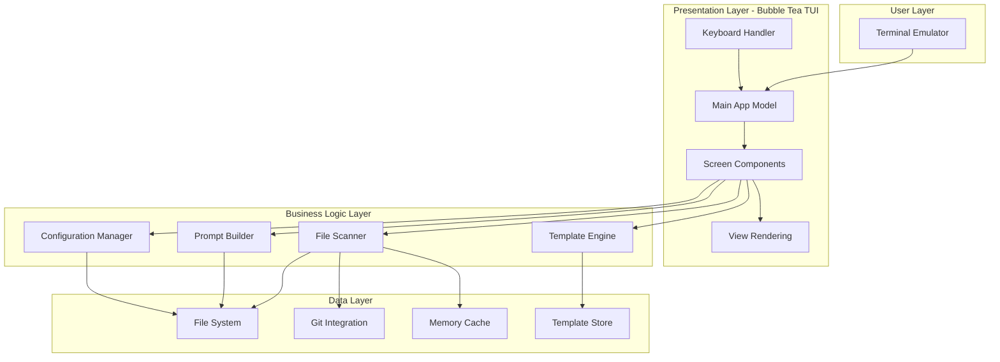
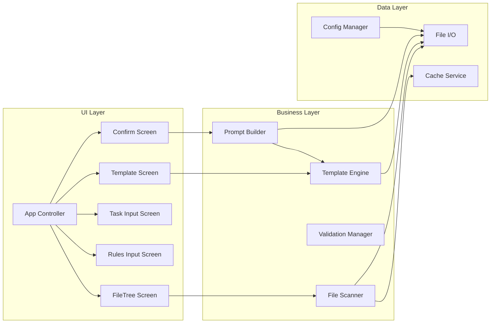
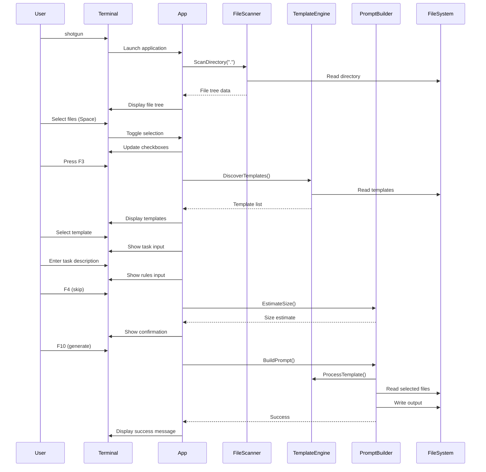
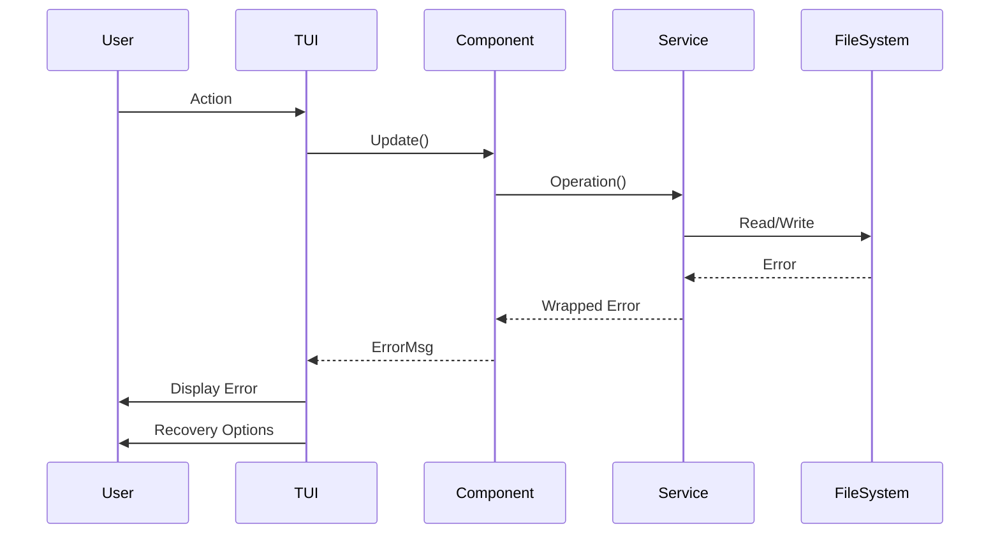

# Shotgun CLI Fullstack Architecture Document

## Introduction

This document outlines the complete fullstack architecture for Shotgun CLI, including backend systems, frontend implementation, and their integration. It serves as the single source of truth for AI-driven development, ensuring consistency across the entire technology stack.

This unified approach combines what would traditionally be separate backend and frontend architecture documents, streamlining the development process for modern fullstack applications where these concerns are increasingly intertwined.

### Starter Template or Existing Project

N/A - Greenfield project. This is a new Go CLI application built from scratch using the Bubble Tea TUI framework.

### Change Log

| Date | Version | Description | Author |
|------|---------|-------------|--------|
| 2025-09-02 | v1.0 | Initial architecture from PRD and specifications | Winston (Architect) |

## High Level Architecture

### Technical Summary

Shotgun CLI is a monolithic terminal application built with Go 1.22+ that follows the Elm Architecture pattern through the Bubble Tea TUI framework. The application consists of a presentation layer (TUI components), business logic layer (file scanning, template processing), and data layer (file system operations, configuration management). All processing occurs locally without network dependencies, with concurrent file operations managed through goroutines and channels. The architecture prioritizes keyboard efficiency, cross-platform compatibility, and sub-second response times while maintaining memory usage under 100MB. This design achieves the PRD goals of rapid prompt generation, zero-configuration startup, and seamless terminal integration.

### Platform and Infrastructure Choice

**Platform:** Local execution on user's machine  
**Key Services:** File system access, terminal I/O, process management  
**Deployment Host and Regions:** Distributed as static binaries via GitHub Releases (no cloud infrastructure required)

### Repository Structure

**Structure:** Monorepo  
**Monorepo Tool:** Go modules with internal packages  
**Package Organization:** Single repository with internal packages for components, core logic, and shared utilities

### High Level Architecture Diagram



### Architectural Patterns

- **Elm Architecture:** Single source of truth state management with immutable updates via Bubble Tea - _Rationale:_ Predictable state management crucial for complex TUI interactions
- **Model-View-Update (MVU):** Pure functional updates with command-based side effects - _Rationale:_ Ensures UI consistency and testability in terminal environment
- **Pipeline Pattern:** Stream-based file processing with channels for memory efficiency - _Rationale:_ Handles large repositories without loading everything into memory
- **Repository Pattern:** Abstract file system operations behind interfaces - _Rationale:_ Enables testing and future extensibility for different storage backends
- **Component-Based UI:** Reusable TUI components using Bubbles library - _Rationale:_ Accelerates development and ensures consistent behavior
- **Worker Pool Pattern:** Concurrent file scanning with controlled parallelism - _Rationale:_ Maximizes performance while preventing resource exhaustion
- **Builder Pattern:** Step-by-step prompt construction with validation - _Rationale:_ Ensures all required data is collected before generation
- **Strategy Pattern:** Pluggable template processors for different formats - _Rationale:_ Supports future template engine additions

## Tech Stack

### Technology Stack Table

| Category | Technology | Version | Purpose | Rationale |
|----------|------------|---------|---------|-----------|
| Frontend Language | Go | 1.22+ | TUI implementation | Native terminal support, cross-platform |
| Frontend Framework | Bubble Tea | v2.0.0-beta.4 | Terminal UI framework | Elm architecture, excellent keyboard support |
| UI Component Library | Bubbles | v0.21.0 | Pre-built TUI components | Accelerates development with tested components |
| State Management | Bubble Tea Models | Built-in | Immutable state management | Integrated with framework, predictable updates |
| Backend Language | Go | 1.22+ | Core business logic | Same as frontend for unified codebase |
| Backend Framework | Standard Library | 1.22+ | File operations, concurrency | Minimal dependencies, excellent performance |
| API Style | N/A | - | No API needed | Local-only application |
| Database | File System | OS-provided | Configuration and templates | No database needed for MVP |
| Cache | sync.Map | Standard library | In-memory caching | Thread-safe caching for file metadata |
| File Storage | Local File System | OS-provided | Template and output storage | Direct file system access |
| Authentication | N/A | - | No auth needed | Local-only application |
| Frontend Testing | Go testing | Standard library | Unit tests for UI components | Native Go testing support |
| Backend Testing | Go testing | Standard library | Unit tests for business logic | Consistent testing approach |
| E2E Testing | teatest | Bubble Tea testing | TUI flow testing | Framework-specific testing utilities |
| Build Tool | Go build | 1.22+ | Compilation and linking | Native Go toolchain |
| Bundler | N/A | - | Single binary output | Go compiles to single executable |
| IaC Tool | N/A | - | No infrastructure needed | Local-only application |
| CI/CD | GitHub Actions | Latest | Automated testing and releases | Free for open source, good Go support |
| Monitoring | N/A | - | No monitoring needed for MVP | Local application, no telemetry |
| Logging | log/slog | Standard library | Structured logging | Native structured logging in Go 1.21+ |
| CSS Framework | Lip Gloss | v1.0.0 | Terminal styling | Programmatic styling for TUI |

## Data Models

### FileItem

**Purpose:** Represents a file or directory in the file tree with selection state

**Key Attributes:**
- Path: string - Absolute file path
- Name: string - Display name (basename)
- IsDir: bool - Directory flag
- IsSelected: bool - Selection state
- IsBinary: bool - Binary file indicator
- IsIgnored: bool - Gitignore status
- Size: int64 - File size in bytes
- Children: []FileItem - Child items for directories

#### TypeScript Interface
```typescript
interface FileItem {
  path: string;
  name: string;
  isDir: boolean;
  isSelected: boolean;
  isBinary: boolean;
  isIgnored: boolean;
  size: number;
  children: FileItem[];
}
```

#### Relationships
- Hierarchical self-reference for tree structure
- Many-to-one relationship with parent directory

### Template

**Purpose:** Defines a prompt template with metadata and variables

**Key Attributes:**
- ID: string - Unique template identifier
- Name: string - Display name
- Version: string - Semantic version
- Description: string - Template purpose
- Author: string - Template creator
- Tags: []string - Categorization tags
- Variables: map[string]Variable - Template variables
- Content: string - Template content with placeholders

#### TypeScript Interface
```typescript
interface Template {
  id: string;
  name: string;
  version: string;
  description: string;
  author: string;
  tags: string[];
  variables: Record<string, Variable>;
  content: string;
}
```

#### Relationships
- One-to-many relationship with Variables
- Referenced by AppState during selection

### Variable

**Purpose:** Defines a template variable with type and validation rules

**Key Attributes:**
- Name: string - Variable name
- Type: string - Variable type (text, multiline, auto, choice, boolean, number)
- Required: bool - Required flag
- Default: string - Default value
- Placeholder: string - UI placeholder text
- MinLength: int - Minimum length for text
- MaxLength: int - Maximum length for text
- Options: []string - Choices for choice type

#### TypeScript Interface
```typescript
interface Variable {
  name: string;
  type: 'text' | 'multiline' | 'auto' | 'choice' | 'boolean' | 'number';
  required: boolean;
  default?: string;
  placeholder?: string;
  minLength?: number;
  maxLength?: number;
  options?: string[];
}
```

#### Relationships
- Many-to-one relationship with Template
- Referenced during prompt generation

### AppState

**Purpose:** Central application state managed by Bubble Tea

**Key Attributes:**
- CurrentScreen: ScreenType - Active screen identifier
- FileTree: []FileItem - File tree data
- SelectedFiles: []string - Selected file paths
- SelectedTemplate: *Template - Chosen template
- TaskContent: string - User-entered task
- RulesContent: string - User-entered rules
- OutputSize: int64 - Estimated output size
- Error: error - Current error state

#### TypeScript Interface
```typescript
interface AppState {
  currentScreen: 'fileTree' | 'template' | 'task' | 'rules' | 'confirm';
  fileTree: FileItem[];
  selectedFiles: string[];
  selectedTemplate: Template | null;
  taskContent: string;
  rulesContent: string;
  outputSize: number;
  error: Error | null;
}
```

#### Relationships
- Aggregates all other models
- Single source of truth for UI state

## API Specification

N/A - Shotgun CLI is a local terminal application with no API layer. All operations are performed through direct file system access and terminal I/O.

## Components

### Main Application Controller

**Responsibility:** Orchestrates the Bubble Tea application lifecycle, manages global state, and coordinates screen transitions

**Key Interfaces:**
- Init() tea.Cmd - Initialize application
- Update(tea.Msg) (tea.Model, tea.Cmd) - Handle messages
- View() string - Render current screen

**Dependencies:** All screen components, core services

**Technology Stack:** Bubble Tea framework, Go standard library

### File Scanner Service

**Responsibility:** Recursively scans directories, applies ignore patterns, detects binary files, and builds file tree

**Key Interfaces:**
- ScanDirectory(root string) <-chan FileInfo - Stream file information
- ApplyGitignore(patterns []string) - Apply ignore patterns
- DetectBinary(path string) bool - Check if file is binary

**Dependencies:** File system, gitignore parser, filetype detector

**Technology Stack:** Go concurrency primitives, doublestar for patterns, h2non/filetype for detection

### Template Engine

**Responsibility:** Discovers, loads, validates, and processes templates with variable substitution

**Key Interfaces:**
- DiscoverTemplates() []Template - Find all available templates
- LoadTemplate(id string) (*Template, error) - Load specific template
- ProcessTemplate(tmpl *Template, vars map[string]string) (string, error) - Execute template

**Dependencies:** File system, TOML parser, text/template engine

**Technology Stack:** BurntSushi/toml for parsing, Go text/template for processing

### Screen Components

**Responsibility:** Individual TUI screens implementing the 5-step wizard flow

**Key Interfaces:**
- Update(msg tea.Msg) (Model, tea.Cmd) - Handle screen-specific messages
- View() string - Render screen UI
- Validate() error - Validate screen state

**Dependencies:** Bubble Tea framework, Bubbles components, core services

**Technology Stack:** Bubble Tea for state management, Bubbles for UI components, Lip Gloss for styling

### Prompt Builder

**Responsibility:** Assembles final prompt from template, selected files, and user input

**Key Interfaces:**
- BuildPrompt(config BuildConfig) tea.Cmd - Async prompt generation
- EstimateSize(files []string) int64 - Calculate output size
- WriteOutput(content string, path string) error - Save to file

**Dependencies:** Template engine, file scanner, file system

**Technology Stack:** Go channels for streaming, text/template for assembly

### Component Diagrams



## External APIs

N/A - Shotgun CLI operates entirely offline with no external API dependencies. All functionality is self-contained within the binary.

## Core Workflows



## Database Schema

N/A - Shotgun CLI uses the file system for all persistence. Configuration and templates are stored as files:

```
~/.config/shotgun-cli/
├── config.toml          # User configuration
├── templates/           # User-defined templates
│   ├── my_template.toml
│   └── team_template.toml
└── history.json         # Session history (future feature)
```

## Frontend Architecture

### Component Architecture

#### Component Organization
```
internal/screens/
├── filetree/
│   ├── model.go      # FileTree state
│   ├── update.go     # Message handling
│   ├── view.go       # Rendering logic
│   └── keys.go       # Keybindings
├── template/
│   ├── model.go
│   ├── update.go
│   ├── view.go
│   └── list.go       # List component
├── input/
│   ├── task.go       # Task input screen
│   ├── rules.go      # Rules input screen
│   └── editor.go     # Shared editor
└── confirm/
    ├── model.go
    ├── view.go
    └── progress.go   # Progress bar
```

#### Component Template
```go
// Standard Bubble Tea component structure
type FileTreeModel struct {
    items    []FileItem
    cursor   int
    selected map[string]bool
    viewport viewport.Model
}

func NewFileTreeModel() FileTreeModel {
    return FileTreeModel{
        items:    []FileItem{},
        selected: make(map[string]bool),
        viewport: viewport.New(80, 20),
    }
}

func (m FileTreeModel) Update(msg tea.Msg) (FileTreeModel, tea.Cmd) {
    switch msg := msg.(type) {
    case tea.KeyMsg:
        switch msg.String() {
        case "up", "k":
            m.cursor--
        case "down", "j":
            m.cursor++
        case " ":
            m.toggleSelection()
        }
    }
    return m, nil
}

func (m FileTreeModel) View() string {
    return m.viewport.View()
}
```

### State Management Architecture

#### State Structure
```go
type AppState struct {
    CurrentScreen Screen
    FileTree      FileTreeModel
    Template      TemplateModel
    TaskInput     InputModel
    RulesInput    InputModel
    Confirmation  ConfirmModel
    
    // Shared state
    SelectedFiles    []string
    SelectedTemplate *Template
    TaskContent      string
    RulesContent     string
    
    // UI state
    WindowSize tea.WindowSizeMsg
    Error      error
}
```

#### State Management Patterns
- Immutable state updates through Bubble Tea
- Message-based communication between components
- Command pattern for async operations
- Single source of truth in AppState

### Routing Architecture

#### Route Organization
```
Screen Flow:
1. FileTree    (mandatory)
2. Template    (mandatory)  
3. TaskInput   (mandatory)
4. RulesInput  (optional - F4 to skip)
5. Confirm     (mandatory)
```

#### Protected Route Pattern
```go
// Screen transition validation
func (m Model) canAdvance() bool {
    switch m.CurrentScreen {
    case FileTreeScreen:
        return len(m.SelectedFiles) > 0
    case TemplateScreen:
        return m.SelectedTemplate != nil
    case TaskScreen:
        return m.TaskContent != ""
    case RulesScreen:
        return true // Optional
    default:
        return false
    }
}

func (m Model) advance() (Model, tea.Cmd) {
    if !m.canAdvance() {
        m.Error = ErrValidationFailed
        return m, nil
    }
    m.CurrentScreen++
    return m, m.initScreen()
}
```

### Frontend Services Layer

#### API Client Setup
N/A - No API client needed for local file operations

#### Service Example
```go
// File service for frontend screens
type FileService struct {
    scanner *FileScanner
    cache   *sync.Map
}

func (s *FileService) GetFileTree(root string) tea.Cmd {
    return func() tea.Msg {
        files := s.scanner.ScanDirectory(root)
        return FileTreeLoadedMsg{Files: files}
    }
}

func (s *FileService) ReadFileContent(path string) tea.Cmd {
    return func() tea.Msg {
        content, err := os.ReadFile(path)
        if err != nil {
            return ErrorMsg{err}
        }
        return FileContentMsg{Path: path, Content: string(content)}
    }
}
```

## Backend Architecture

### Service Architecture

#### Function Organization
```
internal/core/
├── scanner/
│   ├── scanner.go       # Main scanner logic
│   ├── ignore.go        # Gitignore handling
│   ├── binary.go        # Binary detection
│   └── concurrent.go    # Worker pool
├── template/
│   ├── engine.go        # Template processing
│   ├── discovery.go     # Template finding
│   ├── validation.go    # Variable validation
│   └── builtin.go       # Embedded templates
├── builder/
│   ├── builder.go       # Prompt assembly
│   ├── pipeline.go      # Processing pipeline
│   └── writer.go        # Output generation
└── config/
    ├── config.go        # Configuration
    ├── paths.go         # Path resolution
    └── defaults.go      # Default values
```

#### Function Template
```go
// Service function template
package scanner

type Scanner struct {
    ignorer  *ignore.Ignorer
    detector *filetype.Detector
    workers  int
}

func New(opts ...Option) *Scanner {
    s := &Scanner{
        workers: runtime.NumCPU(),
    }
    for _, opt := range opts {
        opt(s)
    }
    return s
}

func (s *Scanner) ScanDirectory(root string) (<-chan FileInfo, error) {
    if err := s.validatePath(root); err != nil {
        return nil, err
    }
    
    ch := make(chan FileInfo, 100)
    go s.scan(root, ch)
    return ch, nil
}
```

### Database Architecture

#### Schema Design
```sql
-- Future feature: Session history
CREATE TABLE IF NOT EXISTS sessions (
    id TEXT PRIMARY KEY,
    timestamp INTEGER NOT NULL,
    selected_files TEXT NOT NULL, -- JSON array
    template_id TEXT NOT NULL,
    task_content TEXT,
    rules_content TEXT,
    output_path TEXT,
    output_size INTEGER
);

CREATE INDEX idx_sessions_timestamp ON sessions(timestamp DESC);
```

#### Data Access Layer
```go
// Repository pattern for future persistence
type SessionRepository interface {
    Save(session *Session) error
    Load(id string) (*Session, error)
    List(limit int) ([]*Session, error)
    Delete(id string) error
}

type FileSystemRepository struct {
    basePath string
}

func (r *FileSystemRepository) Save(session *Session) error {
    data, err := json.Marshal(session)
    if err != nil {
        return err
    }
    
    path := filepath.Join(r.basePath, session.ID+".json")
    return os.WriteFile(path, data, 0644)
}
```

### Authentication and Authorization

N/A - Shotgun CLI is a local tool with no authentication requirements. File system permissions are inherited from the operating system.

## Unified Project Structure

```plaintext
shotgun-cli/
├── .github/                    # CI/CD workflows
│   └── workflows/
│       ├── ci.yaml            # Test and build
│       ├── release.yaml       # Create releases
│       └── codeql.yaml        # Security scanning
├── cmd/
│   └── shotgun/
│       └── main.go            # Entry point
├── internal/                   # Private packages
│   ├── app/
│   │   ├── app.go            # Main app controller
│   │   ├── model.go          # App state
│   │   ├── update.go         # Message handling
│   │   ├── view.go           # View routing
│   │   └── keys.go           # Global keybindings
│   ├── screens/               # TUI screens
│   │   ├── filetree/
│   │   ├── template/
│   │   ├── input/
│   │   └── confirm/
│   ├── components/            # Reusable UI components
│   │   ├── tree/
│   │   ├── list/
│   │   ├── editor/
│   │   ├── progress/
│   │   └── statusbar/
│   ├── core/                  # Business logic
│   │   ├── scanner/
│   │   ├── template/
│   │   ├── builder/
│   │   └── config/
│   ├── models/                # Data structures
│   │   ├── file.go
│   │   ├── template.go
│   │   ├── variable.go
│   │   └── state.go
│   ├── styles/                # Lip Gloss styles
│   │   ├── theme.go
│   │   ├── colors.go
│   │   └── components.go
│   └── utils/                 # Utilities
│       ├── files.go
│       ├── validation.go
│       └── unicode.go
├── templates/                  # Embedded templates
│   ├── analyze_bug.toml
│   ├── make_diff.toml
│   ├── make_plan.toml
│   └── project_manager.toml
├── testdata/                   # Test fixtures
│   └── sample_project/
├── docs/                       # Documentation
│   ├── prd.md
│   ├── front-end-spec.md
│   └── architecture.md
├── .gitignore
├── .golangci.yml              # Linter config
├── go.mod
├── go.sum
├── Makefile
├── README.md
└── CHANGELOG.md
```

## Development Workflow

### Local Development Setup

#### Prerequisites
```bash
# Install Go 1.22+
brew install go  # macOS
# or
wget https://go.dev/dl/go1.22.0.linux-amd64.tar.gz  # Linux

# Verify installation
go version

# Install development tools
go install github.com/golangci/golangci-lint/cmd/golangci-lint@latest
go install golang.org/x/tools/cmd/goimports@latest
```

#### Initial Setup
```bash
# Clone repository
git clone https://github.com/user/shotgun-cli.git
cd shotgun-cli

# Download dependencies
go mod download

# Run tests
make test

# Build binary
make build
```

#### Development Commands
```bash
# Start all services
make run

# Start frontend only
go run ./cmd/shotgun

# Start backend only
# N/A - monolithic application

# Run tests
make test           # All tests
make test-unit      # Unit tests only
make test-e2e       # E2E tests only
make test-cover     # With coverage
```

### Environment Configuration

#### Required Environment Variables
```bash
# Frontend (.env.local)
# N/A - No frontend env vars needed

# Backend (.env)
DEBUG=true          # Enable debug logging
LOG_LEVEL=debug     # Log verbosity

# Shared
# N/A - No shared env vars needed
```

## Deployment Architecture

### Deployment Strategy

**Frontend Deployment:**
- **Platform:** User's local machine
- **Build Command:** `go build -o shotgun ./cmd/shotgun`
- **Output Directory:** `./dist/`
- **CDN/Edge:** N/A - Local binary

**Backend Deployment:**
- **Platform:** Same binary as frontend
- **Build Command:** Same as frontend
- **Deployment Method:** Binary distribution via GitHub Releases

### CI/CD Pipeline
```yaml
# .github/workflows/release.yaml
name: Release

on:
  push:
    tags:
      - 'v*'

jobs:
  release:
    runs-on: ubuntu-latest
    strategy:
      matrix:
        goos: [linux, windows, darwin]
        goarch: [amd64, arm64]
        exclude:
          - goos: windows
            goarch: arm64
    
    steps:
      - uses: actions/checkout@v4
      
      - uses: actions/setup-go@v4
        with:
          go-version: '1.22'
      
      - name: Build
        env:
          GOOS: ${{ matrix.goos }}
          GOARCH: ${{ matrix.goarch }}
        run: |
          go build -ldflags="-s -w" -o dist/shotgun-${{ matrix.goos }}-${{ matrix.goarch }} ./cmd/shotgun
      
      - name: Upload Release Assets
        uses: softprops/action-gh-release@v1
        with:
          files: dist/*
```

### Environments

| Environment | Frontend URL | Backend URL | Purpose |
|-------------|--------------|-------------|---------|
| Development | localhost (terminal) | localhost (same process) | Local development |
| Staging | N/A | N/A | Not applicable for CLI |
| Production | User's terminal | User's machine | Production use |

## Security and Performance

### Security Requirements

**Frontend Security:**
- CSP Headers: N/A (terminal application)
- XSS Prevention: N/A (no web content)
- Secure Storage: Respect OS file permissions

**Backend Security:**
- Input Validation: Validate all file paths and user input
- Rate Limiting: N/A (local application)
- CORS Policy: N/A (no web API)

**Authentication Security:**
- Token Storage: N/A (no authentication)
- Session Management: N/A (stateless application)
- Password Policy: N/A (no user accounts)

### Performance Optimization

**Frontend Performance:**
- Bundle Size Target: <20MB binary
- Loading Strategy: Immediate with <2s startup
- Caching Strategy: In-memory file metadata cache

**Backend Performance:**
- Response Time Target: <16ms for UI updates
- Database Optimization: Concurrent file scanning with worker pools
- Caching Strategy: sync.Map for thread-safe caching

## Testing Strategy

### Testing Pyramid
```
        E2E Tests
       /        \
    Integration Tests
    /              \
Frontend Unit  Backend Unit
```

### Test Organization

#### Frontend Tests
```
internal/screens/filetree/
├── model_test.go
├── update_test.go
└── view_test.go

internal/components/tree/
├── tree_test.go
└── testdata/
    └── sample_tree.json
```

#### Backend Tests
```
internal/core/scanner/
├── scanner_test.go
├── ignore_test.go
├── binary_test.go
└── testdata/
    ├── .gitignore
    └── sample_files/

internal/core/template/
├── engine_test.go
├── discovery_test.go
└── testdata/
    └── templates/
```

#### E2E Tests
```
e2e/
├── full_flow_test.go
├── navigation_test.go
└── fixtures/
    └── test_project/
```

### Test Examples

#### Frontend Component Test
```go
func TestFileTreeToggleSelection(t *testing.T) {
    model := NewFileTreeModel()
    model.items = []FileItem{
        {Path: "/test.go", Name: "test.go", IsSelected: false},
    }
    model.cursor = 0
    
    // Toggle selection
    model.toggleSelection()
    
    assert.True(t, model.items[0].IsSelected)
    assert.Contains(t, model.selected, "/test.go")
}
```

#### Backend API Test
```go
func TestScannerRespectsGitignore(t *testing.T) {
    scanner := NewScanner()
    scanner.LoadGitignore([]string{"*.log", "node_modules/"})
    
    files := []string{}
    for file := range scanner.ScanDirectory("./testdata") {
        files = append(files, file.Path)
    }
    
    assert.NotContains(t, files, "test.log")
    assert.NotContains(t, files, "node_modules")
}
```

#### E2E Test
```go
func TestCompletePromptGeneration(t *testing.T) {
    app := teatest.NewTestModel(t, app.New())
    
    // Navigate through screens
    app.Send(tea.KeyMsg{Type: tea.KeySpace}) // Select file
    app.Send(tea.KeyMsg{Type: tea.KeyF3})    // Next screen
    app.Send(tea.KeyMsg{Type: tea.KeyEnter}) // Select template
    app.Type("Fix authentication bug")        // Enter task
    app.Send(tea.KeyMsg{Type: tea.KeyCtrlEnter})
    app.Send(tea.KeyMsg{Type: tea.KeyF4})    // Skip rules
    app.Send(tea.KeyMsg{Type: tea.KeyF10})   // Generate
    
    // Verify output file created
    _, err := os.Stat("shotgun_prompt_*.md")
    assert.NoError(t, err)
}
```

## Coding Standards

### Critical Fullstack Rules

- **Type Definitions:** Always define types in internal/models and import from there
- **Error Handling:** All functions that can fail must return error as last value
- **Concurrent Access:** Use channels or sync primitives for shared state
- **Resource Cleanup:** Always use defer for cleanup operations
- **Context Propagation:** Pass context.Context for cancellable operations
- **Testing Coverage:** Minimum 90% coverage for core packages
- **Panic Recovery:** Never panic in library code, only in main()

### Naming Conventions

| Element | Frontend | Backend | Example |
|---------|----------|---------|---------|
| Components | PascalCase | - | `FileTreeModel` |
| Functions | camelCase | camelCase | `scanDirectory()` |
| Interfaces | PascalCase+er | PascalCase+er | `Scanner` |
| Packages | lowercase | lowercase | `scanner` |

## Error Handling Strategy

### Error Flow



### Error Response Format
```go
type AppError struct {
    Code    string
    Message string
    Details map[string]interface{}
    Wrapped error
}

func (e AppError) Error() string {
    return fmt.Sprintf("[%s] %s", e.Code, e.Message)
}
```

### Frontend Error Handling
```go
func (m Model) handleError(err error) (Model, tea.Cmd) {
    var appErr AppError
    if errors.As(err, &appErr) {
        m.Error = appErr
        m.ShowError = true
        
        // Auto-clear after 3 seconds for non-critical errors
        if appErr.Code != "CRITICAL" {
            return m, tea.Tick(3*time.Second, func(t time.Time) tea.Msg {
                return ClearErrorMsg{}
            })
        }
    }
    return m, nil
}
```

### Backend Error Handling
```go
func (s *Scanner) ScanDirectory(root string) (<-chan FileInfo, error) {
    if _, err := os.Stat(root); err != nil {
        return nil, AppError{
            Code:    "FS_NOT_FOUND",
            Message: "Directory not found",
            Details: map[string]interface{}{"path": root},
            Wrapped: err,
        }
    }
    // ... scan logic
}
```

## Monitoring and Observability

### Monitoring Stack

- **Frontend Monitoring:** Debug mode with verbose logging to stderr
- **Backend Monitoring:** Structured logging with slog
- **Error Tracking:** Log aggregation in debug.log file
- **Performance Monitoring:** Built-in profiling with pprof (debug mode)

### Key Metrics

**Frontend Metrics:**
- Frame render time
- Keyboard input latency
- Screen transition time
- Memory usage

**Backend Metrics:**
- File scan rate
- Template processing time
- Goroutine count
- Memory allocations

## Checklist Results Report

_Architecture checklist to be run post-review_