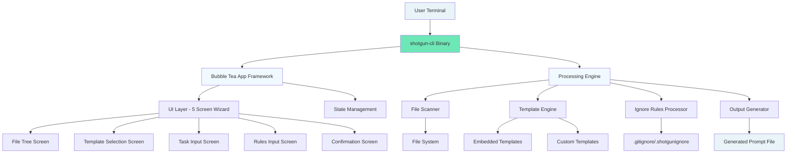
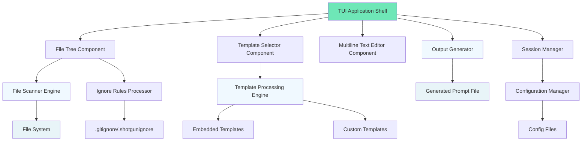
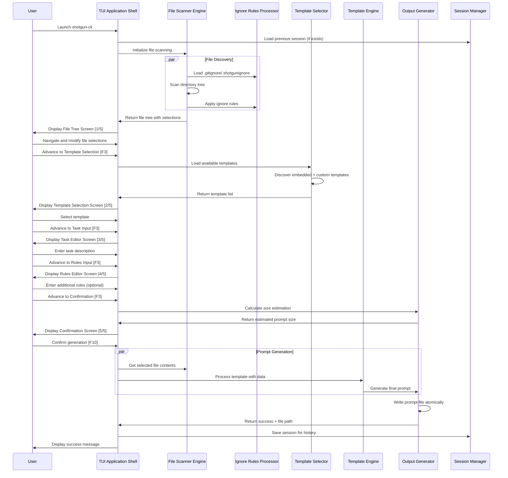
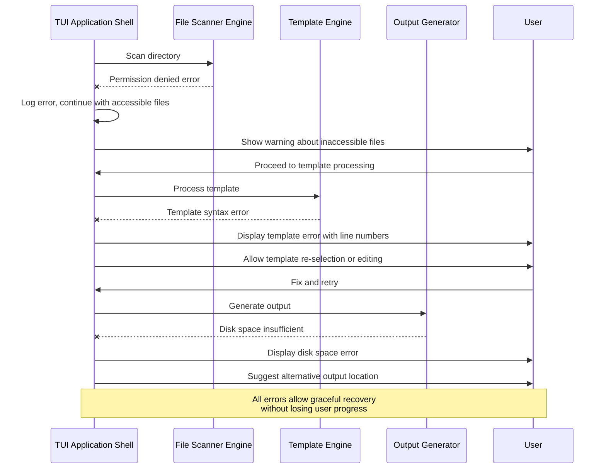
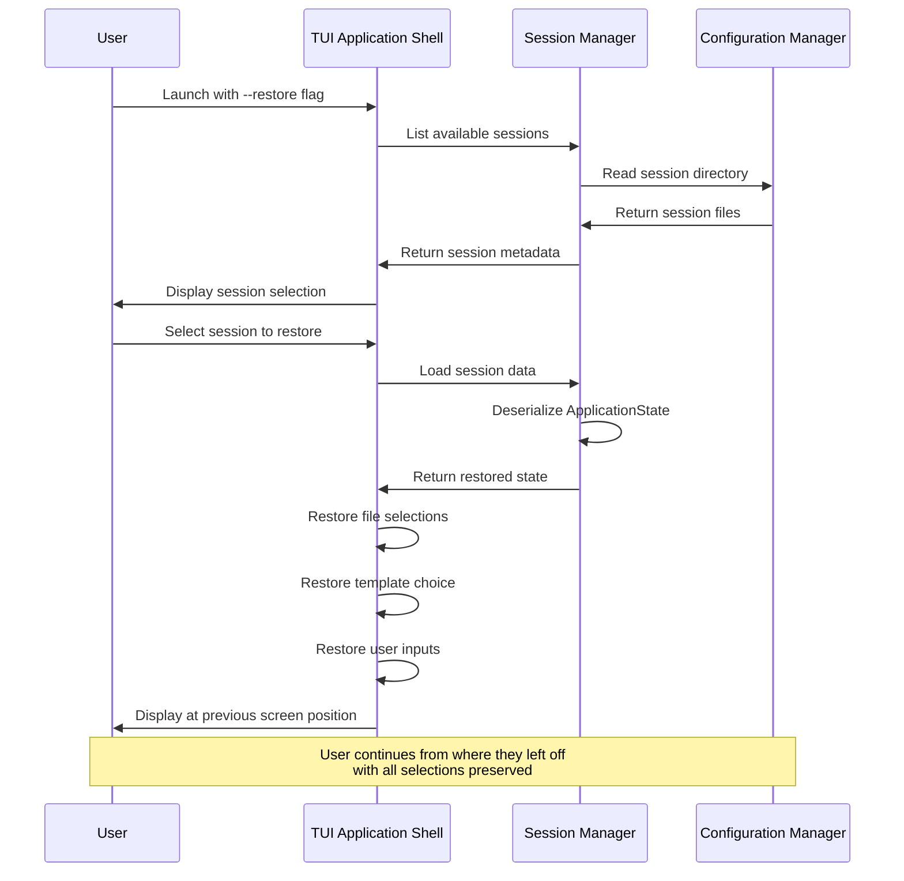
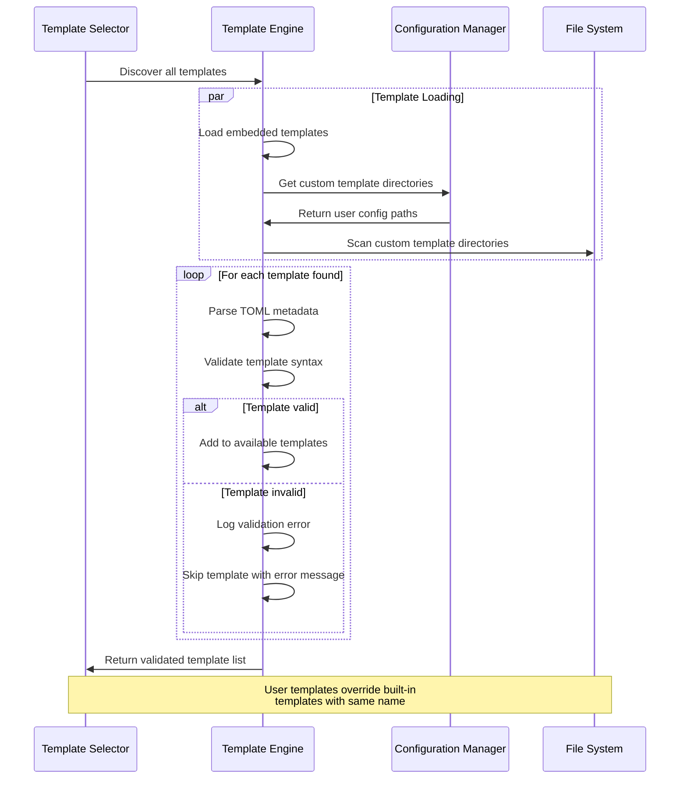
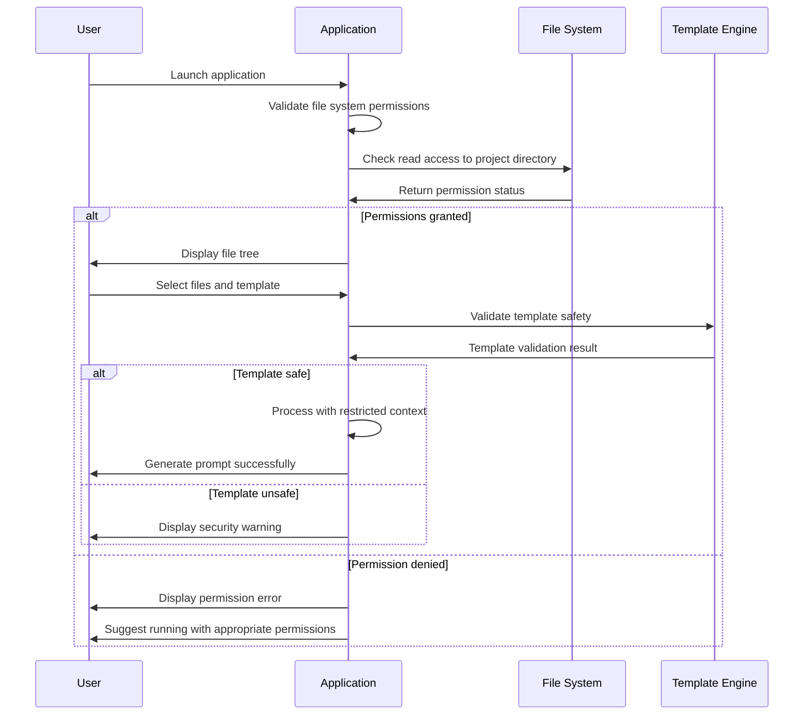
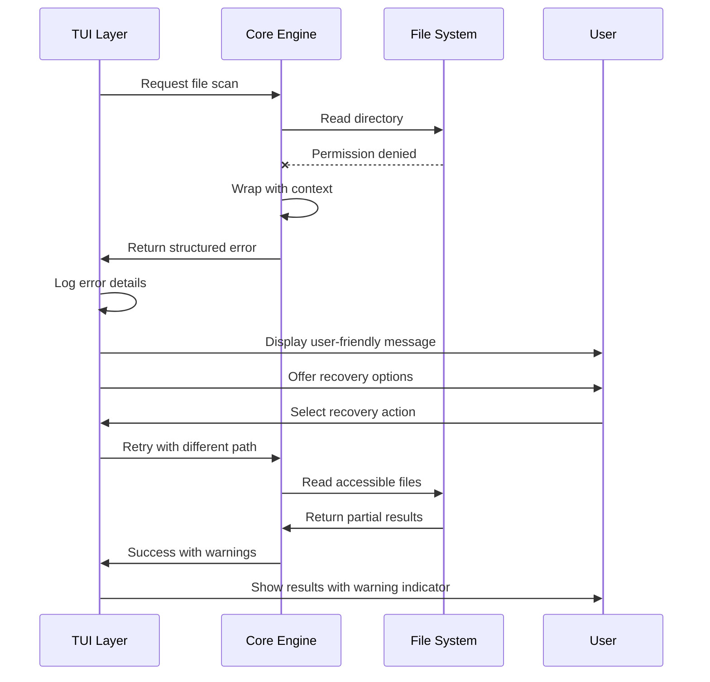

# shotgun-cli-v3 Fullstack Architecture Document

## Introduction

This document outlines the complete architecture for **shotgun-cli-v3**, a high-performance Terminal User Interface (TUI) application built with Go that generates standardized LLM prompts from templates. While traditionally "fullstack" refers to web applications, this document treats the TUI interface as the "frontend" layer and the core processing engine as the "backend" layer, providing a unified architectural approach for this sophisticated command-line application.

This unified architecture combines what would traditionally be separate interface design and core system architecture, streamlining development for a modern Go application where the terminal interface and processing engine are tightly integrated through the Bubble Tea reactive framework.

### Starter Template or Existing Project

Based on the PRD review, this is a **greenfield project** that will be built from scratch using the Go ecosystem. The project follows established patterns for TUI applications:

- **Framework Foundation:** Built on Charm's Bubble Tea v2.0.0-beta.4 (Elm Architecture)
- **Component Library:** Bubbles v0.21.0 for mature UI components
- **Styling Framework:** Lip Gloss v1.0.0 for terminal styling
- **No Web Framework Dependencies:** Pure terminal application with no HTTP/web components

**Decision:** N/A - Greenfield project with carefully selected Go TUI stack

### Change Log
| Date | Version | Description | Author |
|------|---------|-------------|--------|
| 2024-03-15 | 1.0 | Initial architecture document creation | Winston (Architect) |

## High Level Architecture

### Technical Summary

shotgun-cli-v3 employs a **monolithic TUI architecture** with concurrent processing capabilities, built as a single Go binary that combines reactive terminal interface management with high-performance file processing. The application uses Bubble Tea's Elm Architecture for predictable state management in the terminal interface while leveraging Go's concurrency primitives (goroutines, channels, worker pools) for efficient file scanning and template processing. The architecture achieves the PRD's performance goals through strategic separation of concerns: the TUI layer handles user interaction and display rendering, while the processing engine manages file discovery, content aggregation, and prompt generation concurrently. Cross-platform compatibility is achieved through Go's native compilation and the Charm ecosystem's proven terminal abstraction, enabling deployment as a single executable across Windows, Linux, and macOS without runtime dependencies.

### Platform and Infrastructure Choice

For a Go TUI application, the "infrastructure" primarily concerns cross-platform binary distribution and terminal compatibility rather than cloud services:

**Platform:** GitHub Releases + Cross-Platform Native Binaries  
**Key Services:** GitHub Actions (CI/CD), GitHub Releases (Distribution), Go Cross-Compilation  
**Deployment Regions:** Global (binary downloads), Cross-Platform (Windows, Linux, macOS)

### Repository Structure

Given the monolithic nature of the TUI application and the PRD's emphasis on a single binary, a **standard Go project structure** is most appropriate:

**Structure:** Single repository with standard Go project layout  
**Monorepo Tool:** Not applicable - standard Go modules  
**Package Organization:** Internal packages for domain separation (ui/, scanner/, templates/, etc.)

### High Level Architecture Diagram



### Architectural Patterns

- **Elm Architecture (TEA):** Reactive UI state management through Bubble Tea - _Rationale:_ Predictable state updates and excellent testing capabilities for complex TUI workflows
- **Command Pattern:** Screen navigation and user actions as discrete commands - _Rationale:_ Enables undo/redo functionality and clean separation of UI concerns from business logic  
- **Worker Pool Pattern:** Concurrent file processing with bounded concurrency - _Rationale:_ Optimal performance for file scanning while preventing resource exhaustion on large repositories
- **Template Method Pattern:** Pluggable template processing with consistent pipeline - _Rationale:_ Supports both embedded and custom templates with unified processing logic
- **Repository Pattern:** Abstract file system operations for testing and flexibility - _Rationale:_ Enables comprehensive testing without file system dependencies and future storage backends
- **Pipeline Pattern:** Sequential processing stages for prompt generation - _Rationale:_ Clear separation of concerns from file discovery through final output generation

## Tech Stack

### Technology Stack Table

| Category | Technology | Version | Purpose | Rationale |
|----------|------------|---------|---------|-----------|
| Primary Language | Go | 1.22+ | Core application development | Native compilation, excellent concurrency, cross-platform support, no runtime dependencies |
| TUI Framework | Bubble Tea | v2.0.0-beta.4 | Reactive terminal interface | Mature Elm Architecture implementation, excellent Windows support, active development |
| UI Components | Bubbles | v0.21.0 | Pre-built TUI components | Proven components (filepicker, textarea, list) with horizontal scrolling support |
| Terminal Styling | Lip Gloss | v1.0.0 | Advanced terminal styling | Sophisticated styling with gradients, layouts, consistent cross-platform rendering |
| Template Engine | text/template | Go stdlib | Template processing | Built-in security, custom function maps, no external dependencies |
| File Processing | doublestar | v4.6+ | Glob pattern matching | .gitignore/.shotgunignore pattern support with proper escaping |
| File Type Detection | filetype | v1.1+ | Binary file detection | Fast magic number detection for excluding binary files |
| Configuration | Viper | v1.18+ | Config management | Cross-platform config directories, environment variable support |
| CLI Framework | Cobra | v1.8+ | Command line interface | Standard Go CLI framework with shell completion support |
| Data Format | TOML | BurntSushi/toml v1.3+ | Template metadata | Human-readable config format, better than YAML for metadata |
| Build Tool | Go toolchain | 1.22+ | Native build system | Cross-compilation, module management, integrated testing |
| Task Runner | Makefile | GNU Make | Build automation | Simple, universal automation for common tasks |
| Version Control | Git | 2.40+ | Source control | Industry standard, required for .gitignore processing |
| CI/CD | GitHub Actions | Latest | Automated builds | Native GitHub integration, matrix builds for cross-platform |
| Testing Framework | testing | Go stdlib | Unit testing | Native Go testing with table-driven tests |
| TUI Testing | teatest | v0.1+ | TUI interaction testing | Bubble Tea testing helpers for UI workflows |
| Benchmarking | testing | Go stdlib | Performance testing | Built-in benchmarking for file scanning optimization |
| Linting | golangci-lint | v1.55+ | Code quality | Comprehensive linter suite with performance checks |
| Cross-Platform | Native Go | 1.22+ | Platform compatibility | Built-in cross-compilation without CGO dependencies |

## Data Models

### ApplicationState

**Purpose:** Central state container managing the complete wizard workflow and user session

**Key Attributes:**
- CurrentScreen: ScreenType - Active screen in the 5-screen wizard
- FileSelection: FileSelectionState - Complete file tree with selection states  
- TemplateChoice: SelectedTemplate - Chosen template with metadata
- UserInputs: UserInputData - Task description and optional rules
- GenerationConfig: GenerationSettings - Output configuration and preferences

#### TypeScript Interface
```go
type ApplicationState struct {
    CurrentScreen     ScreenType           `json:"current_screen"`
    FileSelection     *FileSelectionState  `json:"file_selection"`
    TemplateChoice    *SelectedTemplate    `json:"template_choice"`
    UserInputs        *UserInputData       `json:"user_inputs"`
    GenerationConfig  *GenerationSettings  `json:"generation_config"`
    SessionID         string               `json:"session_id"`
    CreatedAt         time.Time            `json:"created_at"`
    ModifiedAt        time.Time            `json:"modified_at"`
}
```

#### Relationships
- Contains FileSelectionState for file tree management
- References SelectedTemplate for template processing
- Includes UserInputData for text input persistence

### FileNode

**Purpose:** Represents individual files and directories in the hierarchical file tree with selection capabilities

**Key Attributes:**
- Path: string - Relative file path from project root
- Name: string - File or directory name for display
- IsDirectory: bool - Directory vs file classification
- IsSelected: bool - User selection state for prompt inclusion
- IsIgnored: bool - Excluded by .gitignore/.shotgunignore rules
- IsBinary: bool - Binary file detection result
- Size: int64 - File size in bytes for estimation calculations
- Children: []FileNode - Nested directory contents

#### TypeScript Interface
```go
type FileNode struct {
    Path        string      `json:"path"`
    Name        string      `json:"name"`
    IsDirectory bool        `json:"is_directory"`
    IsSelected  bool        `json:"is_selected"`
    IsIgnored   bool        `json:"is_ignored"`
    IsBinary    bool        `json:"is_binary"`
    Size        int64       `json:"size"`
    ModTime     time.Time   `json:"mod_time"`
    Children    []*FileNode `json:"children,omitempty"`
    Parent      *FileNode   `json:"-"` // Avoid circular references in JSON
}
```

#### Relationships
- Self-referential tree structure (Parent/Children)
- Aggregated in FileSelectionState for complete tree management

### Template

**Purpose:** Template definition containing metadata and processing instructions for prompt generation

**Key Attributes:**
- ID: string - Unique template identifier
- Name: string - Human-readable template name
- Version: string - Template version for compatibility
- Description: string - Template purpose and usage guidance
- Author: string - Template creator information
- Content: string - Raw template content with placeholders
- Variables: []string - Required template variables
- IsBuiltIn: bool - Embedded vs user-created template distinction

#### TypeScript Interface
```go
type Template struct {
    ID          string            `toml:"id" json:"id"`
    Name        string            `toml:"name" json:"name"`
    Version     string            `toml:"version" json:"version"`
    Description string            `toml:"description" json:"description"`
    Author      string            `toml:"author" json:"author"`
    Tags        []string          `toml:"tags" json:"tags"`
    Content     string            `toml:"content" json:"content"`
    Variables   []string          `toml:"variables" json:"variables"`
    IsBuiltIn   bool              `json:"is_builtin"`
    FilePath    string            `json:"file_path"`
    Metadata    map[string]string `toml:"metadata" json:"metadata"`
}
```

#### Relationships
- Referenced by SelectedTemplate in ApplicationState
- Processed by TemplateEngine for prompt generation

### PromptGeneration

**Purpose:** Contains all data and configuration needed for final prompt generation and output

**Key Attributes:**
- Template: Template - Selected template with processing instructions
- SelectedFiles: []FileNode - Files chosen for inclusion with content
- TaskDescription: string - User-provided task description
- AdditionalRules: string - Optional user rules and constraints
- OutputPath: string - Generated filename with timestamp
- EstimatedSize: int64 - Size estimation before generation
- GeneratedAt: time.Time - Generation timestamp for tracking

#### TypeScript Interface
```go
type PromptGeneration struct {
    Template        *Template   `json:"template"`
    SelectedFiles   []*FileNode `json:"selected_files"`
    TaskDescription string      `json:"task_description"`
    AdditionalRules string      `json:"additional_rules"`
    OutputPath      string      `json:"output_path"`
    EstimatedSize   int64       `json:"estimated_size"`
    ActualSize      int64       `json:"actual_size"`
    GeneratedAt     time.Time   `json:"generated_at"`
    Success         bool        `json:"success"`
    ErrorMessage    string      `json:"error_message,omitempty"`
}
```

#### Relationships
- Aggregates Template and FileNode data for processing
- Created from ApplicationState during final generation step

## API Specification

Since **shotgun-cli-v3** is a standalone TUI application rather than a web service, it doesn't expose traditional REST/GraphQL APIs. However, the application does have important internal interfaces and potential extension points that function as "APIs" within the Go ecosystem:

### Internal Package APIs

The application exposes clean Go package interfaces that serve as internal APIs for modularity and testing:

#### Template Processing API
```go
// Package: internal/template
type TemplateEngine interface {
    LoadTemplates(dirs []string) error
    GetAvailableTemplates() ([]*Template, error)
    ProcessTemplate(template *Template, data *TemplateData) (string, error)
    ValidateTemplate(template *Template) error
}

type TemplateData struct {
    Task           string
    Rules          string
    FileStructure  string
    FileContents   map[string]string
    ProjectName    string
    GeneratedAt    time.Time
}
```

#### File Processing API
```go
// Package: internal/scanner
type FileScanner interface {
    ScanDirectory(rootPath string) (*FileNode, error)
    ApplyIgnoreRules(root *FileNode, rules []string) error
    GetSelectedFiles(root *FileNode) ([]*FileNode, error)
    EstimateSize(files []*FileNode) int64
}

type IgnoreProcessor interface {
    LoadRules(gitignorePath, shotgunignorePath string) error
    ShouldIgnore(path string, isDir bool) bool
    GetActiveRules() []string
}
```

#### State Management API
```go
// Package: internal/state
type StateManager interface {
    SaveSession(state *ApplicationState) error
    LoadSession(sessionID string) (*ApplicationState, error)
    ListSessions() ([]*SessionInfo, error)
    DeleteSession(sessionID string) error
}

type SessionInfo struct {
    ID          string    `json:"id"`
    CreatedAt   time.Time `json:"created_at"`
    ProjectPath string    `json:"project_path"`
    Summary     string    `json:"summary"`
}
```

### CLI Command Interface

The application exposes a command-line interface that serves as its primary external API:

```bash
# Core wizard mode (default)
shotgun

# Direct prompt generation (bypass UI)
shotgun generate --template analyze_bug --task "Debug memory leak" --output custom_prompt.md

# Template management
shotgun template list
shotgun template show analyze_bug
shotgun template create --from-file ./my-template.toml

# Session management
shotgun session list
shotgun session restore <session-id>
shotgun session clean

# Project initialization
shotgun init --create-config --create-ignore

# Configuration
shotgun config show
shotgun config set templates.directory ~/.shotgun/custom-templates
```

### Plugin Extension Points

Future extension capabilities through Go plugin interfaces:

```go
// Package: internal/plugins
type TemplateProvider interface {
    Name() string
    LoadTemplates() ([]*Template, error)
    ValidateTemplate(template *Template) error
}

type OutputProcessor interface {
    Name() string
    ProcessOutput(content string, config map[string]interface{}) (string, error)
    SupportedFormats() []string
}

type FileFilter interface {
    Name() string
    ShouldInclude(file *FileNode, context *FilterContext) bool
    Priority() int
}
```

## Components

### TUI Application Shell

**Responsibility:** Main application orchestration, Bubble Tea program lifecycle, and global state management

**Key Interfaces:**
- `tea.Model` implementation for root application state
- Global key binding handlers (ESC, F1-F10)
- Screen navigation and wizard flow control

**Dependencies:** All UI screen components, StateManager

**Technology Stack:** Bubble Tea v2 Elm Architecture, Lip Gloss styling, Cobra CLI integration

### File Tree Component

**Responsibility:** Hierarchical file browser with checkbox selection, tree expansion/collapse, and real-time file discovery

**Key Interfaces:**
- `tea.Model` for file tree state and rendering
- Selection change events and validation
- Tree navigation and keyboard shortcuts

**Dependencies:** FileScanner, IgnoreProcessor, FileNode data models

**Technology Stack:** Bubbles filepicker extended with custom checkbox logic, concurrent file scanning

### Template Selector Component

**Responsibility:** Template discovery, metadata display, and user selection interface

**Key Interfaces:**
- Template list rendering with rich metadata
- Selection events and template preview
- Built-in vs custom template differentiation

**Dependencies:** TemplateEngine, Template data models

**Technology Stack:** Bubbles list component with custom item rendering, TOML metadata parsing

### Multiline Text Editor Component

**Responsibility:** Advanced text input with UTF-8 support, clipboard integration, and editing modes

**Key Interfaces:**
- Text editing events and content validation
- Mode switching (edit vs navigation)
- Character/word counting and status display

**Dependencies:** None (self-contained UI component)

**Technology Stack:** Bubbles textarea v0.21.0 with UTF-8 handling, clipboard integration

### File Scanner Engine

**Responsibility:** Concurrent directory traversal, binary detection, and ignore rule processing

**Key Interfaces:**
- `ScanDirectory(path string) (*FileNode, error)`
- `ApplyIgnoreRules(root *FileNode, rules []string) error`
- Progress reporting through channels

**Dependencies:** IgnoreProcessor, doublestar glob matching, filetype detection

**Technology Stack:** Go worker pools, channels, doublestar v4, filetype library

### Template Processing Engine

**Responsibility:** Template compilation, variable substitution, and content generation

**Key Interfaces:**
- `ProcessTemplate(template *Template, data *TemplateData) (string, error)`
- Template validation and custom function registration
- Error handling and debugging information

**Dependencies:** Go text/template, custom function library

**Technology Stack:** Native Go text/template with security-safe processing

### Ignore Rules Processor

**Responsibility:** .gitignore/.shotgunignore parsing, pattern matching, and file exclusion logic

**Key Interfaces:**
- `LoadRules(gitignorePath, shotgunignorePath string) error`
- `ShouldIgnore(path string, isDir bool) bool`
- Rule precedence and conflict resolution

**Dependencies:** doublestar pattern matching

**Technology Stack:** doublestar v4 glob patterns, custom precedence logic

### Output Generator

**Responsibility:** Final prompt assembly, Markdown formatting, and file writing with atomic operations

**Key Interfaces:**
- `GeneratePrompt(generation *PromptGeneration) error`
- Size estimation and progress reporting
- File system operations with error recovery

**Dependencies:** Template processing results, selected file contents

**Technology Stack:** Go text/template, Markdown formatting, atomic file operations

### Session Manager

**Responsibility:** Application state persistence, session history, and restoration capabilities

**Key Interfaces:**
- `SaveSession(state *ApplicationState) error`
- `LoadSession(sessionID string) (*ApplicationState, error)`
- Cross-platform config directory management

**Dependencies:** ApplicationState serialization, Viper configuration

**Technology Stack:** JSON serialization, Viper config management, cross-platform file paths

### Configuration Manager

**Responsibility:** User preferences, environment variables, and cross-platform configuration

**Key Interfaces:**
- Configuration loading and validation
- Default value management
- Environment variable override support

**Dependencies:** Viper configuration library

**Technology Stack:** Viper v1.18+, TOML/YAML config formats

## Component Diagrams



## External APIs

Based on the PRD requirements and component design, **shotgun-cli-v3** is designed as a self-contained TUI application with minimal external dependencies. The application operates entirely offline and does not require external API integrations for its core functionality.

**No external APIs are required for the MVP functionality.**

The application achieves its goals through:

- **Local file system operations** for project scanning and template management
- **Embedded templates** packaged within the binary
- **Local configuration** stored in user directories
- **Offline processing** of all template generation and file operations

### Future Extension Possibilities

While not required for the initial release, potential external API integrations could enhance functionality in future versions:

#### GitHub API (Optional Future Enhancement)

- **Purpose:** Enable template sharing and community template repositories
- **Documentation:** https://docs.github.com/en/rest
- **Base URL(s):** https://api.github.com
- **Authentication:** Personal Access Token or GitHub App
- **Rate Limits:** 5,000 requests per hour (authenticated)

**Key Endpoints Used:**
- `GET /repos/{owner}/{repo}/contents/{path}` - Download template files from repositories
- `GET /search/repositories` - Discover community template repositories

**Integration Notes:** Would require network connectivity and authentication setup, potentially conflicting with the offline-first design philosophy

#### Template Registry API (Hypothetical Future Service)

- **Purpose:** Centralized template discovery and version management
- **Documentation:** Not applicable (hypothetical service)
- **Base URL(s):** https://templates.shotgun-cli.dev (example)
- **Authentication:** API key or OAuth
- **Rate Limits:** To be determined

**Key Endpoints Used:**
- `GET /api/v1/templates` - List available templates with metadata
- `GET /api/v1/templates/{id}/download` - Download specific template versions

**Integration Notes:** Would enable template ecosystem but requires infrastructure and maintenance

## Core Workflows

### Primary Workflow: Complete Prompt Generation



### Error Handling Workflow



### Session Management Workflow



### Template Discovery and Validation Workflow



## Database Schema

**shotgun-cli-v3** is designed as a standalone TUI application that operates entirely through file system operations without requiring a traditional database. However, the application does have structured data storage requirements that are implemented through file-based persistence:

### File-Based Data Storage

Instead of a database, the application uses structured file storage with the following schema:

#### Session Storage Schema (JSON)

**File Location:** `~/.config/shotgun-cli/sessions/{session-id}.json`

```json
{
  "session_id": "20240315-143022-abc123",
  "created_at": "2024-03-15T14:30:22Z",
  "modified_at": "2024-03-15T14:35:10Z",
  "project_path": "/Users/dev/my-project",
  "current_screen": "confirmation",
  "file_selection": {
    "root_path": "/Users/dev/my-project",
    "total_files": 156,
    "selected_count": 23,
    "ignored_count": 89,
    "tree": {
      "path": ".",
      "name": "my-project",
      "is_directory": true,
      "is_selected": true,
      "is_ignored": false,
      "is_binary": false,
      "size": 0,
      "children": [...]
    }
  },
  "template_choice": {
    "template_id": "analyze_bug",
    "template_name": "Bug Analysis",
    "is_builtin": true,
    "file_path": "embedded://templates/analyze_bug.tmpl"
  },
  "user_inputs": {
    "task_description": "Debug memory leak in file processing",
    "additional_rules": "Focus on goroutine usage and channel handling",
    "character_count": 89,
    "word_count": 12
  },
  "generation_config": {
    "output_filename": "shotgun_prompt_20240315_1430.md",
    "estimated_size": 45678,
    "include_binary_warning": true,
    "max_file_size": 1048576
  }
}
```

#### Template Metadata Schema (TOML)

**File Location:** `~/.config/shotgun-cli/templates/{template-name}.toml`

```toml
[metadata]
id = "custom_code_review"
name = "Code Review Assistant"
version = "1.2.0"
description = "Comprehensive code review with security and performance focus"
author = "Development Team"
tags = ["code-review", "security", "performance"]
created_at = "2024-03-10T09:00:00Z"
updated_at = "2024-03-15T11:30:00Z"

[variables]
required = ["TASK", "FILE_STRUCTURE", "FILE_CONTENTS"]
optional = ["RULES", "PROJECT_NAME"]

[settings]
max_file_size = 1048576
exclude_binary = true
preserve_structure = true

[content]
template = """
# Code Review Request

## Task
{{.TASK}}

{{if .RULES}}
## Additional Guidelines
{{.RULES}}
{{end}}

## Project Structure
{{.FILE_STRUCTURE}}

## File Contents
{{range $path, $content := .FILE_CONTENTS}}
### {{$path}}
```
{{$content}}
```
{{end}}
"""
```

#### Configuration Schema (TOML)

**File Location:** `~/.config/shotgun-cli/config.toml`

```toml
[general]
default_template = "make_plan"
auto_save_sessions = true
max_sessions = 50
session_cleanup_days = 30

[templates]
directory = "~/.config/shotgun-cli/templates"
auto_discover = true
validate_on_load = true

[file_processing]
max_file_size = 1048576  # 1MB
max_total_size = 10485760  # 10MB  
worker_count = 0  # 0 = auto-detect based on CPU cores
scan_timeout = 30  # seconds

[ui]
theme = "monochrome"
accent_color = "#6ee7b7"
highlight_color = "#fbbf24"
animation_speed = "normal"

[output]
default_filename = "shotgun_prompt_{{.Timestamp}}.md"
output_directory = "."
backup_prompts = false
```

### Data Relationships and Constraints

#### File System Constraints

```plaintext
Session Files:
- Filename format: YYYYMMDD-HHMMSS-{random}.json
- Maximum size: 10MB (prevent excessive session data)
- Retention: Configurable cleanup after N days
- Validation: JSON schema validation on load

Template Files:
- Filename format: {template-id}.toml
- TOML metadata validation required
- Template content must pass Go text/template parsing
- No circular dependencies in template references

Configuration:
- Single config.toml file per user
- Environment variable overrides supported
- Default values for all required settings
- Backward compatibility for schema versions
```

#### Index Files for Performance

**Session Index:** `~/.config/shotgun-cli/sessions/index.json`

```json
{
  "last_updated": "2024-03-15T14:35:10Z",
  "sessions": [
    {
      "id": "20240315-143022-abc123",
      "created_at": "2024-03-15T14:30:22Z",
      "project_path": "/Users/dev/my-project",
      "summary": "Bug Analysis - my-project",
      "file_count": 23,
      "estimated_size": 45678
    }
  ]
}
```

## Frontend Architecture

In the context of **shotgun-cli-v3**, the "frontend" refers to the Terminal User Interface (TUI) layer built with Bubble Tea. This section defines the TUI-specific architecture patterns and components:

### Component Architecture

The TUI follows a component-based architecture using Bubble Tea's `tea.Model` interface for each screen and reusable UI element:

#### Component Organization

```plaintext
internal/ui/
├── app/                    # Main application shell
│   ├── app.go             # Root Bubble Tea model
│   ├── navigation.go      # Screen navigation logic  
│   └── keybindings.go     # Global key handlers
├── screens/               # 5-screen wizard components
│   ├── filetree/          # File selection screen [1/5]
│   ├── templates/         # Template selection screen [2/5]
│   ├── taskinput/         # Task description screen [3/5]
│   ├── rulesinput/        # Rules input screen [4/5]
│   └── confirmation/      # Final confirmation screen [5/5]
├── components/            # Reusable UI components
│   ├── filetree.go       # Hierarchical file tree widget
│   ├── templatelist.go   # Template selection list
│   ├── texteditor.go     # Advanced multiline editor
│   ├── progressbar.go    # Progress indicators
│   └── statusbar.go      # Status and help display
├── styles/               # Lip Gloss styling
│   ├── theme.go          # Monochrome theme definition
│   ├── colors.go         # Color palette constants
│   └── layout.go         # Layout and spacing utilities
└── messages/             # Bubble Tea messages
    ├── navigation.go     # Screen change messages
    ├── file.go          # File operation messages
    └── generation.go    # Prompt generation messages
```

#### Component Template

```go
// Base component interface for all UI elements
type Component interface {
    tea.Model
    SetSize(width, height int) Component
    Focus() tea.Cmd
    Blur() tea.Cmd
    IsFocused() bool
}

// Example: File Tree Component
type FileTreeComponent struct {
    width, height int
    focused       bool
    root         *models.FileNode
    cursor       int
    viewport     viewport.Model
    styles       *styles.Theme
}

func (c FileTreeComponent) Init() tea.Cmd {
    return nil
}

func (c FileTreeComponent) Update(msg tea.Msg) (tea.Model, tea.Cmd) {
    switch msg := msg.(type) {
    case tea.KeyMsg:
        return c.handleKeyPress(msg)
    case tea.WindowSizeMsg:
        return c.handleResize(msg)
    case messages.FileSelectionChanged:
        return c.handleSelectionChange(msg)
    }
    return c, nil
}

func (c FileTreeComponent) View() string {
    return c.styles.FileTree.Render(c.renderTree())
}
```

### State Management Architecture

The application uses a centralized state pattern with Bubble Tea's message passing for updates:

#### State Structure

```go
// Central application state
type ApplicationModel struct {
    // Navigation state
    currentScreen ScreenType
    screenStack   []ScreenType
    
    // Screen models
    screens map[ScreenType]tea.Model
    
    // Shared application data
    state *models.ApplicationState
    
    // UI state
    windowSize tea.WindowSizeMsg
    theme      *styles.Theme
    
    // Services
    fileScanner    scanner.FileScanner
    templateEngine template.Engine
    sessionManager session.Manager
}

// Screen-specific state management
type FileTreeModel struct {
    // Component state
    fileTree     *components.FileTreeComponent
    statusBar    *components.StatusBarComponent
    
    // Data state
    rootNode     *models.FileNode
    selectedFiles []*models.FileNode
    
    // UI state
    loading      bool
    error        string
}
```

#### State Management Patterns

- **Centralized Store:** ApplicationModel holds all shared state
- **Component Isolation:** Each screen manages its own UI state
- **Message Passing:** All state changes flow through Bubble Tea messages
- **Immutable Updates:** State changes create new state instances
- **Persistence:** State automatically saved to session files

### Routing Architecture

The TUI uses a screen-based routing system with validation and state preservation:

#### Route Organization

```plaintext
Screen Flow:
FileTree [1/5] → TemplateSelection [2/5] → TaskInput [3/5] → RulesInput [4/5] → Confirmation [5/5]
     ↕              ↕                        ↕                ↕                    ↕
Navigation: F2 (back), F3 (forward), ESC (exit), F1 (help)

Validation Gates:
- FileTree → TemplateSelection: At least one file selected
- TemplateSelection → TaskInput: Valid template chosen  
- TaskInput → RulesInput: Non-empty task description
- RulesInput → Confirmation: No validation (rules optional)
- Confirmation → Generation: Final user confirmation
```

#### Protected Route Pattern

```go
type ScreenRouter struct {
    current     ScreenType
    screens     map[ScreenType]tea.Model
    validators  map[ScreenType]ValidationFunc
}

type ValidationFunc func(state *models.ApplicationState) error

func (r *ScreenRouter) Navigate(direction NavigationDirection, state *models.ApplicationState) error {
    target := r.getTargetScreen(direction)
    
    // Validate transition
    if validator, exists := r.validators[target]; exists {
        if err := validator(state); err != nil {
            return fmt.Errorf("navigation blocked: %w", err)
        }
    }
    
    // Perform navigation
    r.current = target
    return nil
}

// Example validator
func validateFileSelection(state *models.ApplicationState) error {
    if len(state.FileSelection.SelectedFiles()) == 0 {
        return errors.New("at least one file must be selected")
    }
    return nil
}
```

### Frontend Services Layer

The TUI layer communicates with the processing engine through clean service interfaces:

#### API Client Setup

```go
// Service layer for TUI to backend communication
type TUIServices struct {
    fileScanner    scanner.FileScanner
    templateEngine template.Engine  
    outputGenerator output.Generator
    sessionManager session.Manager
    configManager  config.Manager
}

func NewTUIServices() *TUIServices {
    return &TUIServices{
        fileScanner:    scanner.NewConcurrentScanner(),
        templateEngine: template.NewEngine(),
        outputGenerator: output.NewGenerator(),
        sessionManager: session.NewFileManager(),
        configManager:  config.NewViperManager(),
    }
}
```

#### Service Example

```go
// File scanning service integration
type FileService struct {
    scanner scanner.FileScanner
    ignore  ignore.Processor
}

func (fs *FileService) ScanProjectFiles(rootPath string) tea.Cmd {
    return tea.Sequence(
        fs.showScanProgress(),
        tea.Tick(time.Millisecond*100, func(t time.Time) tea.Msg {
            result, err := fs.scanner.ScanDirectory(rootPath)
            if err != nil {
                return messages.FileScanError{Err: err}
            }
            return messages.FileScanComplete{Root: result}
        }),
    )
}

// Template processing service
func (ts *TemplateService) GeneratePrompt(data *models.PromptGeneration) tea.Cmd {
    return func() tea.Msg {
        result, err := ts.engine.ProcessTemplate(data.Template, data)
        if err != nil {
            return messages.GenerationError{Err: err}
        }
        return messages.GenerationComplete{
            Content:    result,
            OutputPath: data.OutputPath,
            Size:       int64(len(result)),
        }
    }
}
```

## Backend Architecture

In the context of **shotgun-cli-v3**, the "backend" refers to the core processing engine that handles file operations, template processing, and prompt generation. This follows a **traditional server architecture** pattern within the single Go binary:

### Service Architecture

The backend uses a layered service architecture with clear separation between business logic and infrastructure concerns:

#### Controller/Route Organization

```plaintext
internal/
├── core/                   # Core business logic
│   ├── scanner/           # File discovery and processing
│   │   ├── scanner.go     # Main file scanning logic
│   │   ├── concurrent.go  # Worker pool implementation
│   │   └── types.go       # File scanning data types
│   ├── template/          # Template processing engine
│   │   ├── engine.go      # Template compilation and execution
│   │   ├── discovery.go   # Template discovery and loading
│   │   ├── validation.go  # Template syntax validation
│   │   └── functions.go   # Custom template functions
│   ├── ignore/            # Ignore rules processing
│   │   ├── processor.go   # .gitignore/.shotgunignore logic
│   │   ├── patterns.go    # Glob pattern matching
│   │   └── precedence.go  # Rule precedence handling
│   └── output/            # Prompt generation and file writing
│       ├── generator.go   # Final prompt assembly
│       ├── formatter.go   # Markdown formatting
│       └── writer.go      # Atomic file operations
├── services/              # Application services layer
│   ├── coordinator.go     # Service orchestration
│   ├── session.go         # Session persistence
│   └── config.go          # Configuration management
└── infrastructure/        # External dependencies
    ├── filesystem/        # File system abstraction
    ├── storage/          # Session storage implementation
    └── platform/         # Cross-platform utilities
```

#### Controller Template

```go
// Service coordinator orchestrates all backend operations
type ServiceCoordinator struct {
    fileScanner    scanner.Service
    templateEngine template.Service
    ignoreProcessor ignore.Service
    outputGenerator output.Service
    sessionManager session.Service
    configManager  config.Service
    
    // Concurrency control
    workerPool     *WorkerPool
    ctx           context.Context
    cancel        context.CancelFunc
}

func NewServiceCoordinator(config *Config) *ServiceCoordinator {
    ctx, cancel := context.WithCancel(context.Background())
    
    return &ServiceCoordinator{
        fileScanner:    scanner.NewService(config.Scanner),
        templateEngine: template.NewService(config.Templates),
        ignoreProcessor: ignore.NewService(),
        outputGenerator: output.NewService(config.Output),
        sessionManager: session.NewService(config.Session),
        configManager:  config.NewService(),
        workerPool:    NewWorkerPool(config.Concurrency),
        ctx:           ctx,
        cancel:        cancel,
    }
}

// Orchestrate complete prompt generation workflow
func (sc *ServiceCoordinator) GeneratePrompt(req *GenerationRequest) (*GenerationResult, error) {
    // Phase 1: File processing
    files, err := sc.processFiles(req.FileSelection)
    if err != nil {
        return nil, fmt.Errorf("file processing failed: %w", err)
    }
    
    // Phase 2: Template processing
    content, err := sc.processTemplate(req.Template, files, req.UserInputs)
    if err != nil {
        return nil, fmt.Errorf("template processing failed: %w", err)
    }
    
    // Phase 3: Output generation
    result, err := sc.generateOutput(content, req.OutputConfig)
    if err != nil {
        return nil, fmt.Errorf("output generation failed: %w", err)
    }
    
    return result, nil
}
```

### Database Architecture

Since the application uses file-based storage instead of a traditional database, the backend implements a repository pattern for data access:

#### Schema Design

```go
// Repository interfaces for data access abstraction
type SessionRepository interface {
    Save(session *models.ApplicationState) error
    Load(sessionID string) (*models.ApplicationState, error)
    List() ([]*models.SessionInfo, error)
    Delete(sessionID string) error
}

type TemplateRepository interface {
    LoadAll() ([]*models.Template, error)
    LoadByID(id string) (*models.Template, error)
    Save(template *models.Template) error
    Validate(template *models.Template) error
}

type ConfigRepository interface {
    Load() (*models.Config, error)
    Save(config *models.Config) error
    GetDefault() *models.Config
}
```

#### Data Access Layer

```go
// File-based implementation of session repository
type FileSessionRepository struct {
    baseDir    string
    serializer Serializer
    indexer    SessionIndexer
}

func (fsr *FileSessionRepository) Save(session *models.ApplicationState) error {
    // Generate filename with timestamp
    filename := fmt.Sprintf("%s.json", session.SessionID)
    path := filepath.Join(fsr.baseDir, "sessions", filename)
    
    // Serialize session data
    data, err := fsr.serializer.Marshal(session)
    if err != nil {
        return fmt.Errorf("serialization failed: %w", err)
    }
    
    // Atomic write operation
    if err := fsr.atomicWrite(path, data); err != nil {
        return fmt.Errorf("file write failed: %w", err)
    }
    
    // Update session index
    return fsr.indexer.AddSession(session.ToSessionInfo())
}

func (fsr *FileSessionRepository) atomicWrite(path string, data []byte) error {
    tempPath := path + ".tmp"
    
    // Write to temporary file
    if err := ioutil.WriteFile(tempPath, data, 0644); err != nil {
        return err
    }
    
    // Atomic rename
    return os.Rename(tempPath, path)
}

// Concurrent template processing
type TemplateService struct {
    repository TemplateRepository
    engine     *template.Template
    validator  TemplateValidator
    cache      *TemplateCache
}

func (ts *TemplateService) ProcessTemplate(tmpl *models.Template, data *TemplateData) (string, error) {
    // Check cache first
    if cached, found := ts.cache.Get(tmpl.ID, data.Hash()); found {
        return cached, nil
    }
    
    // Validate template
    if err := ts.validator.Validate(tmpl); err != nil {
        return "", fmt.Errorf("template validation failed: %w", err)
    }
    
    // Execute template with data
    var buf bytes.Buffer
    if err := ts.engine.Execute(&buf, data); err != nil {
        return "", fmt.Errorf("template execution failed: %w", err)
    }
    
    result := buf.String()
    
    // Cache result
    ts.cache.Set(tmpl.ID, data.Hash(), result)
    
    return result, nil
}
```

### Authentication and Authorization

As a single-user desktop application, **shotgun-cli-v3** doesn't require traditional authentication. However, it implements security measures for file access and template processing:

#### Auth Flow



#### Middleware/Guards

```go
// Security middleware for file operations
type FileAccessGuard struct {
    allowedPaths []string
    deniedPaths  []string
    maxFileSize  int64
}

func (fag *FileAccessGuard) ValidateAccess(path string) error {
    // Check if path is within allowed directories
    absPath, err := filepath.Abs(path)
    if err != nil {
        return fmt.Errorf("invalid path: %w", err)
    }
    
    // Prevent path traversal attacks
    if strings.Contains(absPath, "..") {
        return errors.New("path traversal not allowed")
    }
    
    // Check against denied paths
    for _, denied := range fag.deniedPaths {
        if strings.HasPrefix(absPath, denied) {
            return fmt.Errorf("access denied to path: %s", path)
        }
    }
    
    return nil
}

// Template security validator
type TemplateSafetyValidator struct {
    allowedFunctions map[string]bool
    maxExecutionTime time.Duration
}

func (tsv *TemplateSafetyValidator) ValidateTemplate(tmpl *models.Template) error {
    // Parse template to check for unsafe operations
    parsed, err := template.New("validation").Parse(tmpl.Content)
    if err != nil {
        return fmt.Errorf("template parsing failed: %w", err)
    }
    
    // Check for restricted functions or operations
    if err := tsv.validateAST(parsed); err != nil {
        return fmt.Errorf("template contains unsafe operations: %w", err)
    }
    
    return nil
}

// Execution context with resource limits
type ExecutionContext struct {
    timeout     time.Duration
    memoryLimit int64
    fileLimit   int
}

func (ec *ExecutionContext) WithTimeout(fn func() error) error {
    ctx, cancel := context.WithTimeout(context.Background(), ec.timeout)
    defer cancel()
    
    done := make(chan error, 1)
    go func() {
        done <- fn()
    }()
    
    select {
    case err := <-done:
        return err
    case <-ctx.Done():
        return fmt.Errorf("operation timed out after %v", ec.timeout)
    }
}
```

## Unified Project Structure

The following structure accommodates the Go TUI application architecture with clear separation of concerns and standard Go project conventions:

```plaintext
shotgun-cli-v3/
├── .github/                    # CI/CD workflows
│   └── workflows/
│       ├── ci.yml              # Continuous integration
│       ├── release.yml         # Automated releases
│       └── codeql-analysis.yml # Security scanning
├── cmd/                        # Application entry points
│   └── shotgun/
│       └── main.go             # Main application entry
├── internal/                   # Private application packages
│   ├── ui/                     # TUI "Frontend" Layer
│   │   ├── app/                # Main application shell
│   │   │   ├── app.go          # Root Bubble Tea model
│   │   │   ├── navigation.go   # Screen navigation logic
│   │   │   └── keybindings.go  # Global key handlers
│   │   ├── screens/            # 5-screen wizard components
│   │   │   ├── filetree/       # File selection screen [1/5]
│   │   │   ├── templates/      # Template selection screen [2/5]
│   │   │   ├── taskinput/      # Task description screen [3/5]
│   │   │   ├── rulesinput/     # Rules input screen [4/5]
│   │   │   └── confirmation/   # Final confirmation screen [5/5]
│   │   ├── components/         # Reusable UI components
│   │   │   ├── filetree.go     # Hierarchical file tree widget
│   │   │   ├── templatelist.go # Template selection list
│   │   │   ├── texteditor.go   # Advanced multiline editor
│   │   │   ├── progressbar.go  # Progress indicators
│   │   │   └── statusbar.go    # Status and help display
│   │   ├── styles/             # Lip Gloss styling
│   │   │   ├── theme.go        # Monochrome theme definition
│   │   │   ├── colors.go       # Color palette constants
│   │   │   └── layout.go       # Layout and spacing utilities
│   │   └── messages/           # Bubble Tea messages
│   │       ├── navigation.go   # Screen change messages
│   │       ├── file.go         # File operation messages
│   │       └── generation.go   # Prompt generation messages
│   ├── core/                   # "Backend" Processing Engine
│   │   ├── scanner/            # File discovery and processing
│   │   │   ├── scanner.go      # Main file scanning logic
│   │   │   ├── concurrent.go   # Worker pool implementation
│   │   │   └── types.go        # File scanning data types
│   │   ├── template/           # Template processing engine
│   │   │   ├── engine.go       # Template compilation and execution
│   │   │   ├── discovery.go    # Template discovery and loading
│   │   │   ├── validation.go   # Template syntax validation
│   │   │   └── functions.go    # Custom template functions
│   │   ├── ignore/             # Ignore rules processing
│   │   │   ├── processor.go    # .gitignore/.shotgunignore logic
│   │   │   ├── patterns.go     # Glob pattern matching
│   │   │   └── precedence.go   # Rule precedence handling
│   │   └── output/             # Prompt generation and file writing
│   │       ├── generator.go    # Final prompt assembly
│   │       ├── formatter.go    # Markdown formatting
│   │       └── writer.go       # Atomic file operations
│   ├── services/               # Application services layer
│   │   ├── coordinator.go      # Service orchestration
│   │   ├── session.go          # Session persistence
│   │   └── config.go           # Configuration management
│   ├── models/                 # Shared data structures
│   │   ├── application.go      # ApplicationState and core types
│   │   ├── files.go            # FileNode and file-related types
│   │   ├── templates.go        # Template and processing types
│   │   └── config.go           # Configuration structures
│   ├── infrastructure/         # External dependencies abstraction
│   │   ├── filesystem/         # File system operations
│   │   ├── storage/            # Session storage implementations
│   │   └── platform/           # Cross-platform utilities
│   └── testutil/               # Testing utilities and helpers
│       ├── fixtures/           # Test data and fixtures
│       ├── mocks/              # Generated mocks
│       └── helpers.go          # Test helper functions
├── templates/                  # Embedded template assets
│   ├── embedded/               # Built-in templates
│   │   ├── analyze_bug.tmpl    # Bug analysis template
│   │   ├── make_diff.tmpl      # Diff creation template
│   │   ├── make_plan.tmpl      # Planning template
│   │   └── project_manager.tmpl # Project management template
│   └── examples/               # Example custom templates
│       ├── code_review.tmpl    # Code review template example
│       └── documentation.tmpl  # Documentation template example
├── configs/                    # Configuration files and examples
│   ├── default.toml            # Default configuration
│   ├── example.shotgunignore   # Example ignore rules
│   └── template-schema.json    # Template validation schema
├── scripts/                    # Build and development scripts
│   ├── build.sh               # Cross-platform build script
│   ├── test.sh                # Testing script
│   ├── lint.sh                # Linting and formatting
│   └── release.sh             # Release preparation
├── docs/                       # Documentation
│   ├── prd.md                 # Product requirements document
│   ├── architecture.md        # This architecture document
│   ├── api/                   # Internal API documentation
│   └── user-guide.md          # User documentation
├── test/                      # End-to-end tests
│   ├── integration/           # Integration tests
│   ├── e2e/                   # Full workflow tests
│   └── fixtures/              # Test project fixtures
├── .env.example               # Environment variable template
├── .gitignore                 # Git ignore rules
├── .shotgunignore             # Example shotgun ignore rules
├── .golangci.yml              # Linter configuration
├── go.mod                     # Go module definition
├── go.sum                     # Go dependency checksums
├── Makefile                   # Build automation
├── LICENSE                    # Software license
└── README.md                  # Project documentation
```

## Development Workflow

### Local Development Setup

#### Prerequisites

```bash
# Go 1.22+ installation
curl -OL https://golang.org/dl/go1.22.0.linux-amd64.tar.gz
sudo tar -C /usr/local -xzf go1.22.0.linux-amd64.tar.gz
export PATH=$PATH:/usr/local/go/bin

# Development tools
go install honnef.co/go/tools/cmd/staticcheck@latest
go install github.com/golangci/golangci-lint/cmd/golangci-lint@latest
go install github.com/vektra/mockery/v2@latest

# Optional: Air for hot reloading during development
go install github.com/cosmtrek/air@latest
```

#### Initial Setup

```bash
# Clone and setup project
git clone https://github.com/org/shotgun-cli-v3.git
cd shotgun-cli-v3

# Initialize Go module and download dependencies
go mod download
go mod verify

# Generate mocks for testing
make generate

# Build embedded templates
make embed-templates

# Run initial tests to verify setup
make test

# Build development binary
make build-dev
```

#### Development Commands

```bash
# Start development with hot reload (if using Air)
make dev

# Or standard development build and run
make build-dev && ./bin/shotgun-dev

# Run specific screen tests
make test-ui

# Run core logic tests only
make test-core

# Run full test suite with coverage
make test-coverage

# Lint and format code
make lint
make fmt

# Cross-platform build (all targets)
make build-all

# Run benchmarks
make bench

# Generate documentation
make docs
```

### Environment Configuration

#### Required Environment Variables

```bash
# Development (.env.local)
# Application configuration
SHOTGUN_LOG_LEVEL=debug
SHOTGUN_TEMPLATES_DIR=./templates/embedded
SHOTGUN_CONFIG_DIR=./.shotgun-dev

# Testing configuration
SHOTGUN_TEST_MODE=true
SHOTGUN_TEST_FIXTURES=./test/fixtures

# Build configuration
CGO_ENABLED=0
GOOS=linux  # or darwin, windows
GOARCH=amd64

# Optional: Enable Bubble Tea debug mode
TEA_DEBUG=1

# Optional: Performance profiling
SHOTGUN_ENABLE_PROFILING=true
SHOTGUN_PROFILE_OUTPUT=./profiles
```

## Deployment Architecture

### Deployment Strategy

**Frontend Deployment:**
- **Platform:** GitHub Releases with cross-compiled binaries
- **Build Command:** `make build-all` (builds for Windows, Linux, macOS)
- **Output Directory:** `./dist/` with platform-specific binaries
- **CDN/Edge:** GitHub's global CDN for release asset distribution

**Backend Deployment:**
- **Platform:** Single binary deployment (no separate backend)
- **Build Command:** `go build -ldflags="-s -w" -o shotgun cmd/shotgun/main.go`
- **Deployment Method:** Direct binary execution, no server deployment required

### CI/CD Pipeline

```yaml
name: Build and Release

on:
  push:
    branches: [main]
    tags: ['v*']
  pull_request:
    branches: [main]

jobs:
  test:
    name: Test
    runs-on: ubuntu-latest
    steps:
      - uses: actions/checkout@v4
      
      - name: Set up Go
        uses: actions/setup-go@v4
        with:
          go-version: '1.22'
          
      - name: Cache Go modules
        uses: actions/cache@v3
        with:
          path: ~/go/pkg/mod
          key: ${{ runner.os }}-go-${{ hashFiles('**/go.sum') }}
          
      - name: Run tests
        run: |
          go test -v -race -coverprofile=coverage.out ./...
          go tool cover -html=coverage.out -o coverage.html
          
      - name: Run linting
        uses: golangci/golangci-lint-action@v3
        with:
          version: latest
          
      - name: Upload coverage reports
        uses: codecov/codecov-action@v3
        with:
          file: ./coverage.out

  build:
    name: Build Cross-Platform Binaries
    needs: test
    runs-on: ubuntu-latest
    if: github.event_name == 'push' && startsWith(github.ref, 'refs/tags/')
    
    strategy:
      matrix:
        goos: [linux, darwin, windows]
        goarch: [amd64, arm64]
        exclude:
          - goos: windows
            goarch: arm64
            
    steps:
      - uses: actions/checkout@v4
      
      - name: Set up Go
        uses: actions/setup-go@v4
        with:
          go-version: '1.22'
          
      - name: Build binary
        env:
          GOOS: ${{ matrix.goos }}
          GOARCH: ${{ matrix.goarch }}
          CGO_ENABLED: 0
        run: |
          # Set binary extension for Windows
          EXT=""
          if [ "$GOOS" = "windows" ]; then EXT=".exe"; fi
          
          # Build with version information
          VERSION=${GITHUB_REF#refs/tags/}
          LDFLAGS="-s -w -X main.Version=$VERSION -X main.BuildTime=$(date -u +%Y-%m-%dT%H:%M:%SZ)"
          
          # Create output directory
          mkdir -p dist
          
          # Build binary
          go build -ldflags="$LDFLAGS" -o "dist/shotgun-$GOOS-$GOARCH$EXT" cmd/shotgun/main.go
          
          # Create archive
          if [ "$GOOS" = "windows" ]; then
            zip -j "dist/shotgun-$GOOS-$GOARCH.zip" "dist/shotgun-$GOOS-$GOARCH$EXT"
          else
            tar -czf "dist/shotgun-$GOOS-$GOARCH.tar.gz" -C dist "shotgun-$GOOS-$GOARCH"
          fi
          
      - name: Upload build artifacts
        uses: actions/upload-artifact@v3
        with:
          name: shotgun-${{ matrix.goos }}-${{ matrix.goarch }}
          path: dist/shotgun-*

  release:
    name: Create Release
    needs: build
    runs-on: ubuntu-latest
    if: github.event_name == 'push' && startsWith(github.ref, 'refs/tags/')
    
    steps:
      - uses: actions/checkout@v4
      
      - name: Download all artifacts
        uses: actions/download-artifact@v3
        with:
          path: ./dist
          
      - name: Generate release notes
        run: |
          # Extract version from tag
          VERSION=${GITHUB_REF#refs/tags/}
          
          # Generate changelog from commits since last tag
          LAST_TAG=$(git describe --tags --abbrev=0 HEAD~1 2>/dev/null || echo "")
          if [ -n "$LAST_TAG" ]; then
            echo "## Changes since $LAST_TAG" > CHANGELOG.md
            git log --pretty=format:"- %s (%an)" $LAST_TAG..HEAD >> CHANGELOG.md
          else
            echo "## Initial Release" > CHANGELOG.md
          fi
          
      - name: Create Release
        uses: softprops/action-gh-release@v1
        with:
          files: |
            dist/**/*.tar.gz
            dist/**/*.zip
          body_path: CHANGELOG.md
          draft: false
          prerelease: ${{ contains(github.ref, '-') }}
        env:
          GITHUB_TOKEN: ${{ secrets.GITHUB_TOKEN }}

  security:
    name: Security Scan
    runs-on: ubuntu-latest
    steps:
      - uses: actions/checkout@v4
      
      - name: Run Gosec Security Scanner
        uses: securecodewarrior/github-action-gosec@master
        with:
          args: './...'
          
      - name: Run Trivy vulnerability scanner
        uses: aquasecurity/trivy-action@master
        with:
          scan-type: 'fs'
          scan-ref: '.'
```

### Environments

| Environment | Frontend URL | Backend URL | Purpose |
|-------------|-------------|-------------|---------|
| Development | Local binary execution | N/A - Single binary | Local development and testing |
| Staging | GitHub Actions artifacts | N/A - Single binary | Pre-release testing and validation |
| Production | GitHub Releases | N/A - Single binary | Live distribution to end users |

## Security and Performance

### Security Requirements

**Frontend Security:**
- CSP Headers: Not applicable (terminal application)
- XSS Prevention: Template output sanitization to prevent terminal escape sequence injection
- Secure Storage: Session data stored with restricted file permissions (0600) in user config directories

**Backend Security:**
- Input Validation: All file paths validated against directory traversal attacks (../ sequences)
- Rate Limiting: File scanning operations limited by configurable timeouts and resource constraints
- CORS Policy: Not applicable (no web API)

**Authentication Security:**
- Token Storage: Not applicable (single-user desktop application)
- Session Management: Local session files with appropriate file system permissions
- Password Policy: Not applicable (no authentication system)

### Performance Optimization

**Frontend Performance:**
- Bundle Size Target: Single binary under 15MB (including embedded templates)
- Loading Strategy: Progressive screen loading with lazy initialization of expensive components
- Caching Strategy: Template parsing results cached in memory, file tree state cached during navigation

**Backend Performance:**
- Response Time Target: File scanning under 5 seconds for 1000+ files, template processing under 2 seconds
- Database Optimization: File-based storage optimized with indexing and atomic operations
- Caching Strategy: Template compilation cache, file metadata cache with TTL expiration

## Testing Strategy

### Testing Pyramid

```plaintext
                E2E Tests
               /         \
          Integration Tests
         /                 \
    TUI Unit Tests    Core Unit Tests
```

### Test Organization

#### Frontend Tests

```plaintext
internal/ui/
├── app/
│   ├── app_test.go              # Application shell tests
│   ├── navigation_test.go       # Screen navigation tests
│   └── keybindings_test.go      # Key handler tests
├── screens/
│   ├── filetree/
│   │   ├── screen_test.go       # File tree screen tests
│   │   └── integration_test.go  # File tree integration tests
│   ├── templates/
│   │   ├── screen_test.go       # Template selection tests
│   │   └── mock_templates_test.go # Template mocking tests
│   └── confirmation/
│       ├── screen_test.go       # Confirmation screen tests
│       └── generation_test.go   # Generation workflow tests
├── components/
│   ├── filetree_test.go         # File tree component tests
│   ├── texteditor_test.go       # Text editor component tests
│   └── progressbar_test.go      # Progress bar component tests
└── styles/
    └── theme_test.go            # Theme and styling tests
```

#### Backend Tests

```plaintext
internal/core/
├── scanner/
│   ├── scanner_test.go          # File scanning unit tests
│   ├── concurrent_test.go       # Concurrency tests
│   └── benchmark_test.go        # Performance benchmarks
├── template/
│   ├── engine_test.go           # Template processing tests
│   ├── validation_test.go       # Template validation tests
│   └── functions_test.go        # Custom function tests
├── ignore/
│   ├── processor_test.go        # Ignore rules tests
│   └── patterns_test.go         # Pattern matching tests
└── output/
    ├── generator_test.go        # Output generation tests
    └── writer_test.go           # File writing tests
```

#### E2E Tests

```plaintext
test/e2e/
├── workflows/
│   ├── complete_generation_test.go    # Full workflow tests
│   ├── session_management_test.go     # Session persistence tests
│   └── error_recovery_test.go         # Error handling tests
├── fixtures/
│   ├── sample_project/                # Test project structures
│   ├── custom_templates/              # Test template files
│   └── expected_outputs/              # Golden file outputs
└── helpers/
    ├── tui_simulator.go               # TUI interaction simulation
    └── project_builder.go             # Test project creation
```

### Test Examples

#### Frontend Component Test

```go
func TestFileTreeComponent_Selection(t *testing.T) {
    // Setup test data
    rootNode := &models.FileNode{
        Path:        "test-project",
        Name:        "test-project",
        IsDirectory: true,
        IsSelected:  true,
        Children: []*models.FileNode{
            {Path: "main.go", Name: "main.go", IsSelected: true},
            {Path: "README.md", Name: "README.md", IsSelected: true},
        },
    }
    
    // Create component
    component := components.NewFileTreeComponent()
    component.SetRoot(rootNode)
    
    tests := []struct {
        name           string
        keypress       string
        expectedCursor int
        expectedSelected bool
    }{
        {
            name:           "arrow down moves cursor",
            keypress:       "down",
            expectedCursor: 1,
            expectedSelected: true,
        },
        {
            name:           "space toggles selection",
            keypress:       " ",
            expectedCursor: 0,
            expectedSelected: false,
        },
    }
    
    for _, tt := range tests {
        t.Run(tt.name, func(t *testing.T) {
            // Simulate key press
            msg := tea.KeyMsg{Type: tea.KeyRunes, Runes: []rune{tt.keypress[0]}}
            model, _ := component.Update(msg)
            
            // Verify expectations
            updatedComponent := model.(components.FileTreeComponent)
            assert.Equal(t, tt.expectedCursor, updatedComponent.Cursor())
            assert.Equal(t, tt.expectedSelected, updatedComponent.CurrentNode().IsSelected)
        })
    }
}
```

#### Backend API Test

```go
func TestTemplateEngine_ProcessTemplate(t *testing.T) {
    // Setup template engine
    engine := template.NewEngine()
    
    // Test template
    tmpl := &models.Template{
        ID:      "test-template",
        Name:    "Test Template",
        Content: "Task: {{.Task}}\n\nFiles:\n{{range .FileContents}}{{.}}\n{{end}}",
    }
    
    // Test data
    data := &template.TemplateData{
        Task: "Debug memory leak",
        FileContents: map[string]string{
            "main.go": "package main\n\nfunc main() {}\n",
            "README.md": "# Test Project\n",
        },
    }
    
    tests := []struct {
        name     string
        template *models.Template
        data     *template.TemplateData
        want     string
        wantErr  bool
    }{
        {
            name:     "valid template processing",
            template: tmpl,
            data:     data,
            want:     "Task: Debug memory leak\n\nFiles:\npackage main\n\nfunc main() {}\n\n# Test Project\n\n",
            wantErr:  false,
        },
        {
            name: "invalid template syntax",
            template: &models.Template{
                ID:      "invalid",
                Content: "{{.InvalidSyntax",
            },
            data:    data,
            wantErr: true,
        },
    }
    
    for _, tt := range tests {
        t.Run(tt.name, func(t *testing.T) {
            result, err := engine.ProcessTemplate(tt.template, tt.data)
            
            if tt.wantErr {
                assert.Error(t, err)
                return
            }
            
            assert.NoError(t, err)
            assert.Equal(t, tt.want, result)
        })
    }
}
```

#### E2E Test

```go
func TestCompleteWorkflow_E2E(t *testing.T) {
    // Create test project
    projectDir := test.CreateSampleProject(t, "test-project", []string{
        "main.go",
        "README.md",
        ".gitignore",
        "internal/core.go",
    })
    defer os.RemoveAll(projectDir)
    
    // Change to project directory
    originalDir, _ := os.Getwd()
    os.Chdir(projectDir)
    defer os.Chdir(originalDir)
    
    // Create test application
    app := ui.NewApp()
    app.SetTestMode(true)
    
    // Run complete workflow simulation
    tm := teatest.NewTestModel(t, app, teatest.WithInitialTermSize(120, 40))
    
    // Step 1: File selection
    teatest.WaitFor(t, tm.Output(), func(bts []byte) bool {
        return strings.Contains(string(bts), "File Selection [1/5]")
    })
    
    // Deselect .gitignore file
    tm.Send(tea.KeyMsg{Type: tea.KeyDown})    // Navigate to .gitignore
    tm.Send(tea.KeyMsg{Type: tea.KeyDown})
    tm.Send(tea.KeyMsg{Type: tea.KeySpace})   // Deselect
    tm.Send(tea.KeyMsg{Type: tea.KeyF3})      // Next screen
    
    // Step 2: Template selection
    teatest.WaitFor(t, tm.Output(), func(bts []byte) bool {
        return strings.Contains(string(bts), "Template Selection [2/5]")
    })
    
    tm.Send(tea.KeyMsg{Type: tea.KeyEnter})   // Select default template
    
    // Step 3: Task input
    teatest.WaitFor(t, tm.Output(), func(bts []byte) bool {
        return strings.Contains(string(bts), "Task Description [3/5]")
    })
    
    tm.Send(tea.KeyMsg{Type: tea.KeyRunes, Runes: []rune("Debug memory leak in core module")})
    tm.Send(tea.KeyMsg{Type: tea.KeyF3})      // Next screen
    
    // Step 4: Rules input (skip)
    teatest.WaitFor(t, tm.Output(), func(bts []byte) bool {
        return strings.Contains(string(bts), "Rules")
    })
    
    tm.Send(tea.KeyMsg{Type: tea.KeyF4})      // Skip rules
    
    // Step 5: Confirmation and generation
    teatest.WaitFor(t, tm.Output(), func(bts []byte) bool {
        return strings.Contains(string(bts), "Confirm Generation [5/5]")
    })
    
    tm.Send(tea.KeyMsg{Type: tea.KeyF10})     // Generate prompt
    
    // Verify output file was created
    teatest.WaitFor(t, tm.Output(), func(bts []byte) bool {
        return strings.Contains(string(bts), "Successfully generated")
    })
    
    // Verify file contents
    files, _ := filepath.Glob("shotgun_prompt_*.md")
    require.Len(t, files, 1, "Expected one generated prompt file")
    
    content, err := ioutil.ReadFile(files[0])
    require.NoError(t, err)
    
    // Verify prompt contains expected elements
    assert.Contains(t, string(content), "Debug memory leak in core module")
    assert.Contains(t, string(content), "main.go")
    assert.Contains(t, string(content), "README.md")
    assert.NotContains(t, string(content), ".gitignore") // Should be excluded
}
```

## Coding Standards

### Critical Fullstack Rules

- **Package Structure:** Always follow the established internal/ structure - ui/ for TUI components, core/ for business logic, services/ for orchestration
- **Error Handling:** All public functions must return error as the last return value and handle errors explicitly - never ignore errors with `_`
- **Context Propagation:** Long-running operations (file scanning, template processing) must accept context.Context as first parameter for cancellation
- **Interface Usage:** Always program to interfaces for testability - FileScanner, TemplateEngine, etc. must be interfaces, not concrete types
- **Resource Cleanup:** All file operations, goroutines, and channels must have explicit cleanup using defer or context cancellation
- **Bubble Tea Messages:** All UI state changes must flow through proper tea.Msg types - never modify model fields directly in Update methods
- **Concurrent Safety:** Shared state must be protected with sync.Mutex or use channels for communication between goroutines
- **Configuration Access:** Never access config values directly - always use the ConfigManager service with proper defaults
- **Template Security:** All template output must be sanitized before display to prevent terminal escape sequence injection
- **File Path Validation:** All file paths must be validated against directory traversal attacks using filepath.Clean and boundary checks

### Naming Conventions

| Element | Frontend | Backend | Example |
|---------|----------|---------|---------|
| TUI Models | PascalCase with Model suffix | - | `FileTreeModel`, `TemplateSelectionModel` |
| TUI Components | PascalCase with Component suffix | - | `FileTreeComponent`, `StatusBarComponent` |
| Services | PascalCase with Service suffix | PascalCase with Service suffix | `FileScanner`, `TemplateEngine` |
| Interfaces | PascalCase | PascalCase | `Scanner`, `Engine`, `Repository` |
| Methods | camelCase | camelCase | `scanDirectory()`, `processTemplate()` |
| Constants | SCREAMING_SNAKE_CASE | SCREAMING_SNAKE_CASE | `MAX_FILE_SIZE`, `DEFAULT_TIMEOUT` |
| Packages | lowercase | lowercase | `scanner`, `template`, `ignore` |
| Files | snake_case | snake_case | `file_tree.go`, `template_engine.go` |

## Error Handling Strategy

### Error Flow



### Error Response Format

```go
// Unified error structure for all application errors
type AppError struct {
    Code        string                 `json:"code"`
    Message     string                 `json:"message"`
    Details     map[string]interface{} `json:"details,omitempty"`
    Timestamp   time.Time              `json:"timestamp"`
    RequestID   string                 `json:"request_id,omitempty"`
    Cause       error                  `json:"-"` // Original error for logging
    Recoverable bool                   `json:"recoverable"`
    Context     string                 `json:"context,omitempty"`
}

func (e *AppError) Error() string {
    return fmt.Sprintf("[%s] %s", e.Code, e.Message)
}

func (e *AppError) Unwrap() error {
    return e.Cause
}

// Error categories for consistent handling
const (
    // File system errors
    ErrCodeFileNotFound     = "FILE_NOT_FOUND"
    ErrCodePermissionDenied = "PERMISSION_DENIED"
    ErrCodeDiskFull         = "DISK_FULL"
    
    // Template errors
    ErrCodeTemplateNotFound    = "TEMPLATE_NOT_FOUND"
    ErrCodeTemplateSyntaxError = "TEMPLATE_SYNTAX_ERROR"
    ErrCodeTemplateTimeout     = "TEMPLATE_TIMEOUT"
    
    // UI errors
    ErrCodeInvalidInput    = "INVALID_INPUT"
    ErrCodeNavigationError = "NAVIGATION_ERROR"
    ErrCodeRenderError     = "RENDER_ERROR"
    
    // System errors
    ErrCodeOutOfMemory = "OUT_OF_MEMORY"
    ErrCodeTimeout     = "TIMEOUT"
    ErrCodeCanceled    = "CANCELED"
)
```

### Frontend Error Handling

```go
// TUI error display and recovery
type ErrorHandler struct {
    logger     *log.Logger
    recovery   map[string]RecoveryAction
    userFacing bool
}

type RecoveryAction struct {
    Description string
    Action      func() tea.Cmd
    Automatic   bool
}

func (eh *ErrorHandler) HandleError(err error, context string) tea.Cmd {
    appErr := eh.wrapError(err, context)
    
    // Log full error details
    eh.logger.Printf("Error [%s]: %s | Context: %s | Details: %+v", 
        appErr.Code, appErr.Message, appErr.Context, appErr.Details)
    
    // Return user-facing command
    if eh.userFacing {
        return eh.createUserMessage(appErr)
    }
    
    return nil
}
```

### Backend Error Handling

```go
// Core processing error handling with context and recovery
type CoreErrorHandler struct {
    logger *log.Logger
    tracer *tracing.Tracer
}

func (ceh *CoreErrorHandler) WrapError(err error, operation string, details map[string]interface{}) *AppError {
    if err == nil {
        return nil
    }
    
    // Check if already an AppError
    var appErr *AppError
    if errors.As(err, &appErr) {
        return appErr
    }
    
    // Create new AppError with context
    appErr = &AppError{
        Code:      ceh.classifyError(err),
        Message:   ceh.sanitizeMessage(err.Error()),
        Details:   details,
        Timestamp: time.Now(),
        RequestID: ceh.generateRequestID(),
        Cause:     err,
        Context:   operation,
        Recoverable: ceh.isRecoverable(err),
    }
    
    return appErr
}
```

## Monitoring and Observability

### Monitoring Stack

- **Frontend Monitoring:** Built-in TUI performance metrics and user interaction tracking
- **Backend Monitoring:** Go runtime metrics, operation timing, and resource usage tracking  
- **Error Tracking:** Structured logging with error categorization and local log files
- **Performance Monitoring:** Built-in profiling support with Go's pprof integration

### Key Metrics

**Frontend Metrics:**
- Screen render times and frame rates
- User interaction response times  
- Memory usage during UI operations
- TUI component load times

**Backend Metrics:**
- File scanning throughput (files/second)
- Template processing latency
- Memory allocation patterns
- Goroutine count and lifecycle

**Application Metrics:**
- Session duration and completion rates
- File selection patterns and sizes
- Template usage statistics
- Error frequencies by category

## Checklist Results Report

*This section will contain the architect checklist validation results after executing the architect-checklist.*