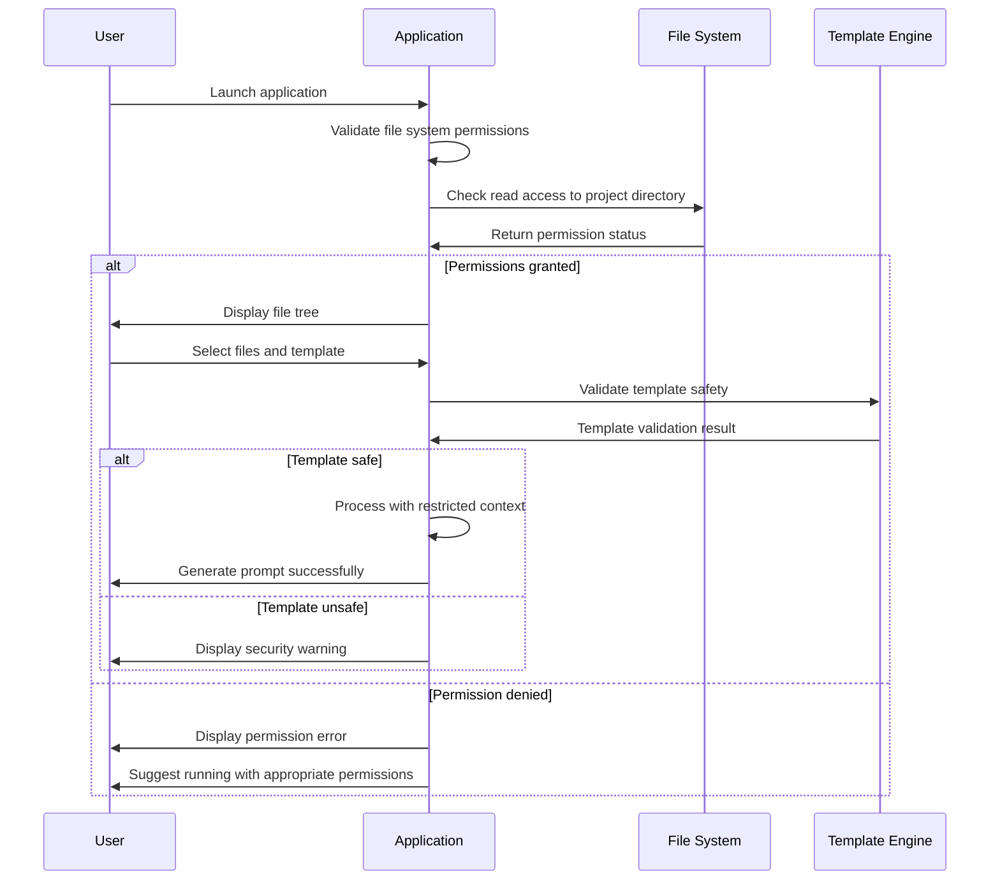

# Backend Architecture

In the context of **shotgun-cli-v3**, the "backend" refers to the core processing engine that handles file operations, template processing, and prompt generation. This follows a **traditional server architecture** pattern within the single Go binary:

### Service Architecture

The backend uses a layered service architecture with clear separation between business logic and infrastructure concerns:

#### Controller/Route Organization

```plaintext
internal/
├── core/                   # Core business logic
│   ├── scanner/           # File discovery and processing
│   │   ├── scanner.go     # Main file scanning logic
│   │   ├── concurrent.go  # Worker pool implementation
│   │   └── types.go       # File scanning data types
│   ├── template/          # Template processing engine
│   │   ├── engine.go      # Template compilation and execution
│   │   ├── discovery.go   # Template discovery and loading
│   │   ├── validation.go  # Template syntax validation
│   │   └── functions.go   # Custom template functions
│   ├── ignore/            # Ignore rules processing
│   │   ├── processor.go   # .gitignore/.shotgunignore logic
│   │   ├── patterns.go    # Glob pattern matching
│   │   └── precedence.go  # Rule precedence handling
│   └── output/            # Prompt generation and file writing
│       ├── generator.go   # Final prompt assembly
│       ├── formatter.go   # Markdown formatting
│       └── writer.go      # Atomic file operations
├── services/              # Application services layer
│   ├── coordinator.go     # Service orchestration
│   ├── session.go         # Session persistence
│   └── config.go          # Configuration management
└── infrastructure/        # External dependencies
    ├── filesystem/        # File system abstraction
    ├── storage/          # Session storage implementation
    └── platform/         # Cross-platform utilities
```

#### Controller Template

```go
// Service coordinator orchestrates all backend operations
type ServiceCoordinator struct {
    fileScanner    scanner.Service
    templateEngine template.Service
    ignoreProcessor ignore.Service
    outputGenerator output.Service
    sessionManager session.Service
    configManager  config.Service
    
    // Concurrency control
    workerPool     *WorkerPool
    ctx           context.Context
    cancel        context.CancelFunc
}

func NewServiceCoordinator(config *Config) *ServiceCoordinator {
    ctx, cancel := context.WithCancel(context.Background())
    
    return &ServiceCoordinator{
        fileScanner:    scanner.NewService(config.Scanner),
        templateEngine: template.NewService(config.Templates),
        ignoreProcessor: ignore.NewService(),
        outputGenerator: output.NewService(config.Output),
        sessionManager: session.NewService(config.Session),
        configManager:  config.NewService(),
        workerPool:    NewWorkerPool(config.Concurrency),
        ctx:           ctx,
        cancel:        cancel,
    }
}

// Orchestrate complete prompt generation workflow
func (sc *ServiceCoordinator) GeneratePrompt(req *GenerationRequest) (*GenerationResult, error) {
    // Phase 1: File processing
    files, err := sc.processFiles(req.FileSelection)
    if err != nil {
        return nil, fmt.Errorf("file processing failed: %w", err)
    }
    
    // Phase 2: Template processing
    content, err := sc.processTemplate(req.Template, files, req.UserInputs)
    if err != nil {
        return nil, fmt.Errorf("template processing failed: %w", err)
    }
    
    // Phase 3: Output generation
    result, err := sc.generateOutput(content, req.OutputConfig)
    if err != nil {
        return nil, fmt.Errorf("output generation failed: %w", err)
    }
    
    return result, nil
}
```

### Database Architecture

Since the application uses file-based storage instead of a traditional database, the backend implements a repository pattern for data access:

#### Schema Design

```go
// Repository interfaces for data access abstraction
type SessionRepository interface {
    Save(session *models.ApplicationState) error
    Load(sessionID string) (*models.ApplicationState, error)
    List() ([]*models.SessionInfo, error)
    Delete(sessionID string) error
}

type TemplateRepository interface {
    LoadAll() ([]*models.Template, error)
    LoadByID(id string) (*models.Template, error)
    Save(template *models.Template) error
    Validate(template *models.Template) error
}

type ConfigRepository interface {
    Load() (*models.Config, error)
    Save(config *models.Config) error
    GetDefault() *models.Config
}
```

#### Data Access Layer

```go
// File-based implementation of session repository
type FileSessionRepository struct {
    baseDir    string
    serializer Serializer
    indexer    SessionIndexer
}

func (fsr *FileSessionRepository) Save(session *models.ApplicationState) error {
    // Generate filename with timestamp
    filename := fmt.Sprintf("%s.json", session.SessionID)
    path := filepath.Join(fsr.baseDir, "sessions", filename)
    
    // Serialize session data
    data, err := fsr.serializer.Marshal(session)
    if err != nil {
        return fmt.Errorf("serialization failed: %w", err)
    }
    
    // Atomic write operation
    if err := fsr.atomicWrite(path, data); err != nil {
        return fmt.Errorf("file write failed: %w", err)
    }
    
    // Update session index
    return fsr.indexer.AddSession(session.ToSessionInfo())
}

func (fsr *FileSessionRepository) atomicWrite(path string, data []byte) error {
    tempPath := path + ".tmp"
    
    // Write to temporary file
    if err := ioutil.WriteFile(tempPath, data, 0644); err != nil {
        return err
    }
    
    // Atomic rename
    return os.Rename(tempPath, path)
}

// Concurrent template processing
type TemplateService struct {
    repository TemplateRepository
    engine     *template.Template
    validator  TemplateValidator
    cache      *TemplateCache
}

func (ts *TemplateService) ProcessTemplate(tmpl *models.Template, data *TemplateData) (string, error) {
    // Check cache first
    if cached, found := ts.cache.Get(tmpl.ID, data.Hash()); found {
        return cached, nil
    }
    
    // Validate template
    if err := ts.validator.Validate(tmpl); err != nil {
        return "", fmt.Errorf("template validation failed: %w", err)
    }
    
    // Execute template with data
    var buf bytes.Buffer
    if err := ts.engine.Execute(&buf, data); err != nil {
        return "", fmt.Errorf("template execution failed: %w", err)
    }
    
    result := buf.String()
    
    // Cache result
    ts.cache.Set(tmpl.ID, data.Hash(), result)
    
    return result, nil
}
```

### Authentication and Authorization

As a single-user desktop application, **shotgun-cli-v3** doesn't require traditional authentication. However, it implements security measures for file access and template processing:

#### Auth Flow



#### Middleware/Guards

```go
// Security middleware for file operations
type FileAccessGuard struct {
    allowedPaths []string
    deniedPaths  []string
    maxFileSize  int64
}

func (fag *FileAccessGuard) ValidateAccess(path string) error {
    // Check if path is within allowed directories
    absPath, err := filepath.Abs(path)
    if err != nil {
        return fmt.Errorf("invalid path: %w", err)
    }
    
    // Prevent path traversal attacks
    if strings.Contains(absPath, "..") {
        return errors.New("path traversal not allowed")
    }
    
    // Check against denied paths
    for _, denied := range fag.deniedPaths {
        if strings.HasPrefix(absPath, denied) {
            return fmt.Errorf("access denied to path: %s", path)
        }
    }
    
    return nil
}

// Template security validator
type TemplateSafetyValidator struct {
    allowedFunctions map[string]bool
    maxExecutionTime time.Duration
}

func (tsv *TemplateSafetyValidator) ValidateTemplate(tmpl *models.Template) error {
    // Parse template to check for unsafe operations
    parsed, err := template.New("validation").Parse(tmpl.Content)
    if err != nil {
        return fmt.Errorf("template parsing failed: %w", err)
    }
    
    // Check for restricted functions or operations
    if err := tsv.validateAST(parsed); err != nil {
        return fmt.Errorf("template contains unsafe operations: %w", err)
    }
    
    return nil
}

// Execution context with resource limits
type ExecutionContext struct {
    timeout     time.Duration
    memoryLimit int64
    fileLimit   int
}

func (ec *ExecutionContext) WithTimeout(fn func() error) error {
    ctx, cancel := context.WithTimeout(context.Background(), ec.timeout)
    defer cancel()
    
    done := make(chan error, 1)
    go func() {
        done <- fn()
    }()
    
    select {
    case err := <-done:
        return err
    case <-ctx.Done():
        return fmt.Errorf("operation timed out after %v", ec.timeout)
    }
}
```

