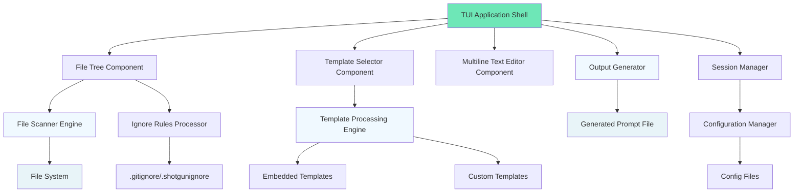

# Component Diagrams

```mermaid
graph TB
    A[TUI Application Shell] --> B[File Tree Component]
    A --> C[Template Selector Component]
    A --> D[Multiline Text Editor Component]
    A --> E[Session Manager]
    
    B --> F[File Scanner Engine]
    B --> G[Ignore Rules Processor]
    
    C --> H[Template Processing Engine]
    
    F --> I[File System]
    G --> J[.gitignore/.shotgunignore]
    H --> K[Embedded Templates]
    H --> L[Custom Templates]
    
    A --> M[Output Generator]
    M --> N[Generated Prompt File]
    
    E --> O[Configuration Manager]
    O --> P[Config Files]
    
    style A fill:#6ee7b7
    style F fill:#f0f9ff
    style H fill:#f0f9ff
    style M fill:#f0f9ff
    style I fill:#e8f4f8
    style N fill:#e8f4f8
```

