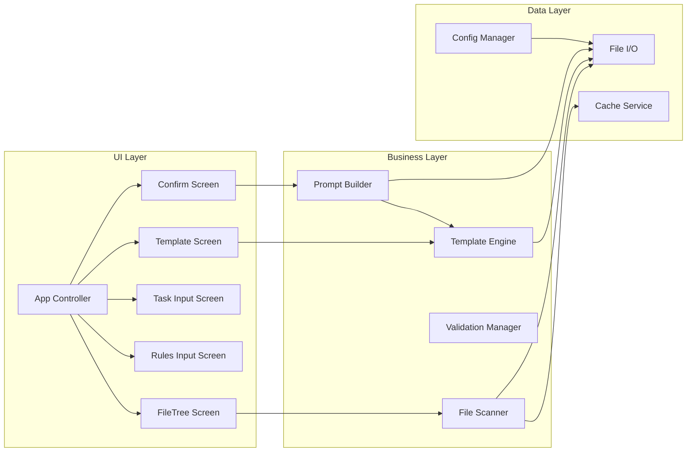

# Components

## Main Application Controller

**Responsibility:** Orchestrates the Bubble Tea application lifecycle, manages global state, and coordinates screen transitions

**Key Interfaces:**
- Init() tea.Cmd - Initialize application
- Update(tea.Msg) (tea.Model, tea.Cmd) - Handle messages
- View() string - Render current screen

**Dependencies:** All screen components, core services

**Technology Stack:** Bubble Tea framework, Go standard library

## File Scanner Service

**Responsibility:** Recursively scans directories, applies ignore patterns, detects binary files, and builds file tree

**Key Interfaces:**
- ScanDirectory(root string) <-chan FileInfo - Stream file information
- ApplyGitignore(patterns []string) - Apply ignore patterns
- DetectBinary(path string) bool - Check if file is binary

**Dependencies:** File system, gitignore parser, filetype detector

**Technology Stack:** Go concurrency primitives, doublestar for patterns, h2non/filetype for detection

## Template Engine

**Responsibility:** Discovers, loads, validates, and processes templates with variable substitution

**Key Interfaces:**
- DiscoverTemplates() []Template - Find all available templates
- LoadTemplate(id string) (*Template, error) - Load specific template
- ProcessTemplate(tmpl *Template, vars map[string]string) (string, error) - Execute template

**Dependencies:** File system, TOML parser, text/template engine

**Technology Stack:** BurntSushi/toml for parsing, Go text/template for processing

## Screen Components

**Responsibility:** Individual TUI screens implementing the 5-step wizard flow

**Key Interfaces:**
- Update(msg tea.Msg) (Model, tea.Cmd) - Handle screen-specific messages
- View() string - Render screen UI
- Validate() error - Validate screen state

**Dependencies:** Bubble Tea framework, Bubbles components, core services

**Technology Stack:** Bubble Tea for state management, Bubbles for UI components, Lip Gloss for styling

## Prompt Builder

**Responsibility:** Assembles final prompt from template, selected files, and user input

**Key Interfaces:**
- BuildPrompt(config BuildConfig) tea.Cmd - Async prompt generation
- EstimateSize(files []string) int64 - Calculate output size
- WriteOutput(content string, path string) error - Save to file

**Dependencies:** Template engine, file scanner, file system

**Technology Stack:** Go channels for streaming, text/template for assembly

## Component Diagrams

