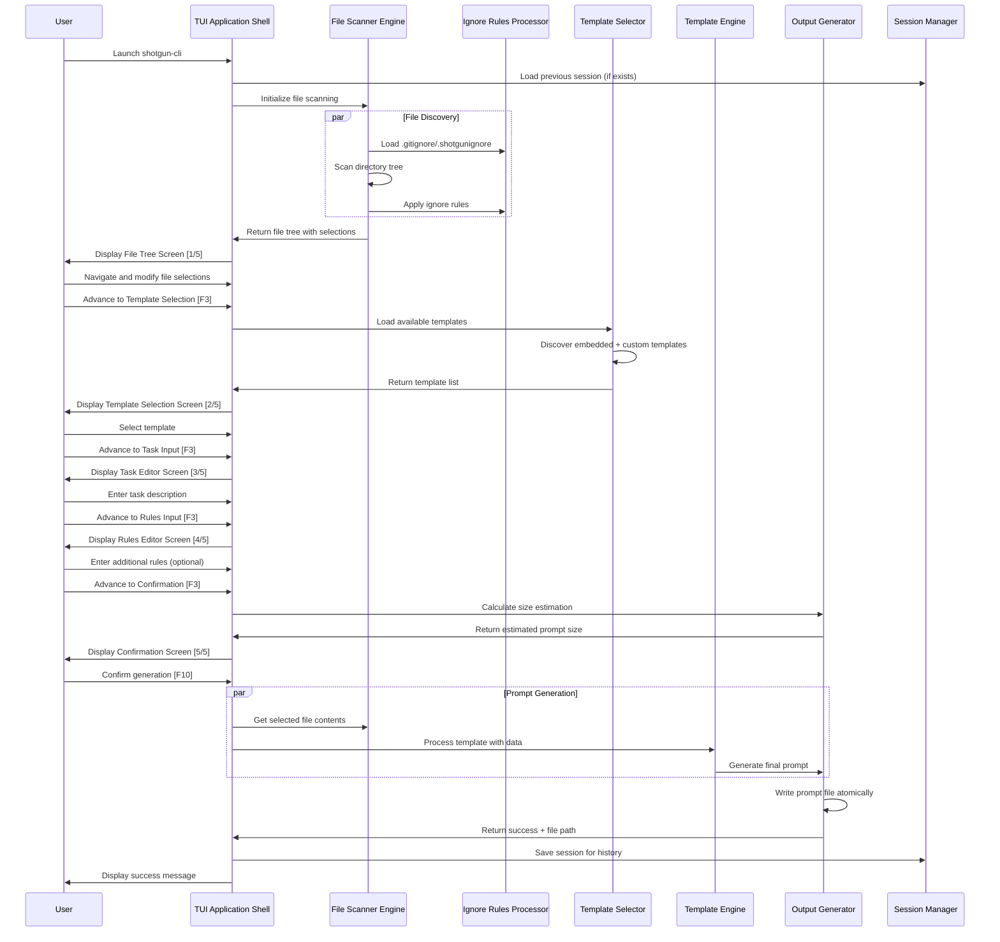
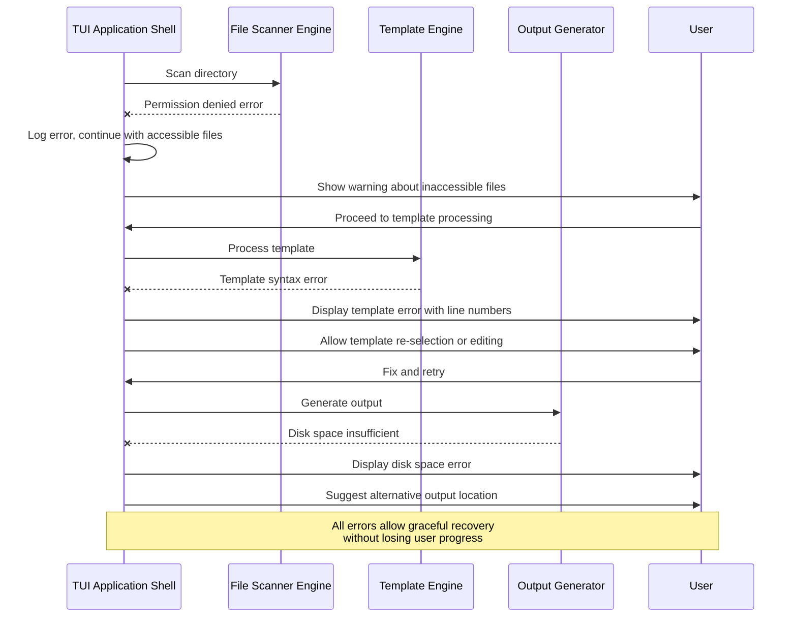
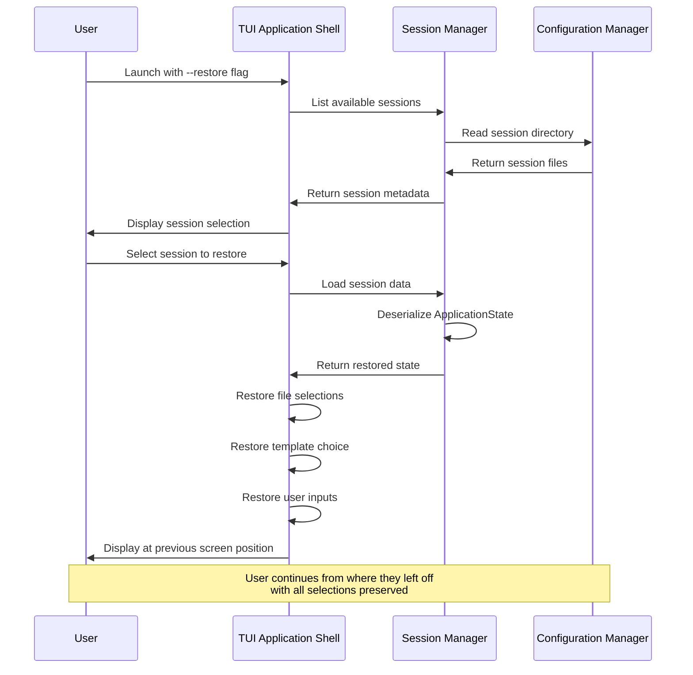
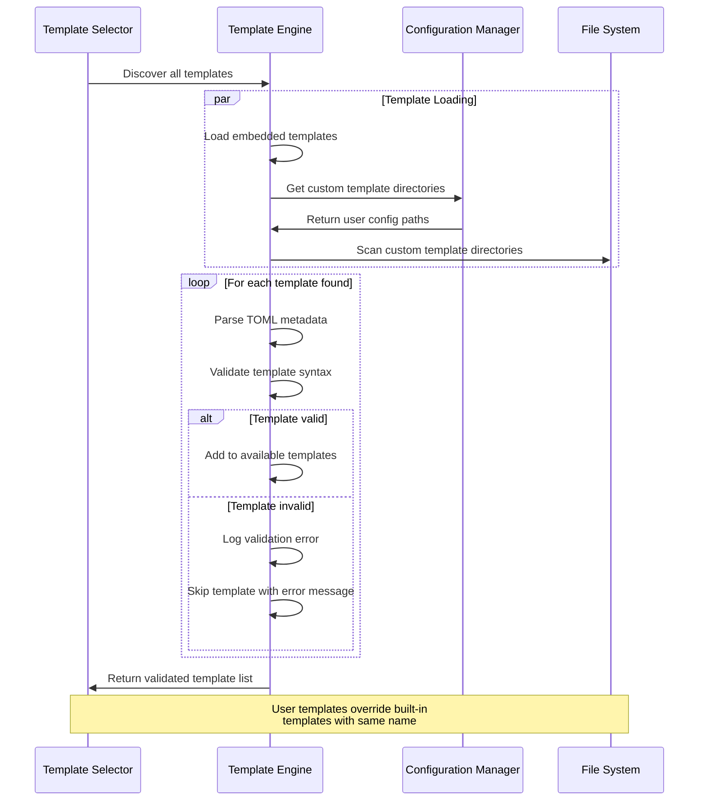

# Core Workflows

### Primary Workflow: Complete Prompt Generation

```mermaid
sequenceDiagram
    participant U as User
    participant TUI as TUI Application Shell
    participant FS as File Scanner Engine
    participant IG as Ignore Rules Processor
    participant TS as Template Selector
    participant TE as Template Engine
    participant OG as Output Generator
    participant SM as Session Manager
    
    U->>TUI: Launch shotgun-cli
    TUI->>SM: Load previous session (if exists)
    TUI->>FS: Initialize file scanning
    
    par File Discovery
        FS->>IG: Load .gitignore/.shotgunignore
        FS->>FS: Scan directory tree
        FS->>IG: Apply ignore rules
    end
    
    FS->>TUI: Return file tree with selections
    TUI->>U: Display File Tree Screen [1/5]
    
    U->>TUI: Navigate and modify file selections
    U->>TUI: Advance to Template Selection [F3]
    
    TUI->>TS: Load available templates
    TS->>TS: Discover embedded + custom templates
    TS->>TUI: Return template list
    TUI->>U: Display Template Selection Screen [2/5]
    
    U->>TUI: Select template
    U->>TUI: Advance to Task Input [F3]
    TUI->>U: Display Task Editor Screen [3/5]
    
    U->>TUI: Enter task description
    U->>TUI: Advance to Rules Input [F3]
    TUI->>U: Display Rules Editor Screen [4/5]
    
    U->>TUI: Enter additional rules (optional)
    U->>TUI: Advance to Confirmation [F3]
    
    TUI->>OG: Calculate size estimation
    OG->>TUI: Return estimated prompt size
    TUI->>U: Display Confirmation Screen [5/5]
    
    U->>TUI: Confirm generation [F10]
    
    par Prompt Generation
        TUI->>FS: Get selected file contents
        TUI->>TE: Process template with data
        TE->>OG: Generate final prompt
    end
    
    OG->>OG: Write prompt file atomically
    OG->>TUI: Return success + file path
    TUI->>SM: Save session for history
    TUI->>U: Display success message
```

### Error Handling Workflow

```mermaid
sequenceDiagram
    participant TUI as TUI Application Shell
    participant FS as File Scanner Engine
    participant TE as Template Engine
    participant OG as Output Generator
    participant U as User
    
    TUI->>FS: Scan directory
    FS--xTUI: Permission denied error
    TUI->>TUI: Log error, continue with accessible files
    TUI->>U: Show warning about inaccessible files
    
    U->>TUI: Proceed to template processing
    TUI->>TE: Process template
    TE--xTUI: Template syntax error
    TUI->>U: Display template error with line numbers
    TUI->>U: Allow template re-selection or editing
    
    U->>TUI: Fix and retry
    TUI->>OG: Generate output
    OG--xTUI: Disk space insufficient
    TUI->>U: Display disk space error
    TUI->>U: Suggest alternative output location
    
    Note over TUI,U: All errors allow graceful recovery<br/>without losing user progress
```

### Session Management Workflow

```mermaid
sequenceDiagram
    participant U as User
    participant TUI as TUI Application Shell
    participant SM as Session Manager
    participant CFG as Configuration Manager
    
    U->>TUI: Launch with --restore flag
    TUI->>SM: List available sessions
    SM->>CFG: Read session directory
    CFG->>SM: Return session files
    SM->>TUI: Return session metadata
    TUI->>U: Display session selection
    
    U->>TUI: Select session to restore
    TUI->>SM: Load session data
    SM->>SM: Deserialize ApplicationState
    SM->>TUI: Return restored state
    
    TUI->>TUI: Restore file selections
    TUI->>TUI: Restore template choice
    TUI->>TUI: Restore user inputs
    TUI->>U: Display at previous screen position
    
    Note over U,CFG: User continues from where they left off<br/>with all selections preserved
```

### Template Discovery and Validation Workflow

```mermaid
sequenceDiagram
    participant TS as Template Selector
    participant TE as Template Engine
    participant CFG as Configuration Manager
    participant FS as File System
    
    TS->>TE: Discover all templates
    
    par Template Loading
        TE->>TE: Load embedded templates
        TE->>CFG: Get custom template directories
        CFG->>TE: Return user config paths
        TE->>FS: Scan custom template directories
    end
    
    loop For each template found
        TE->>TE: Parse TOML metadata
        TE->>TE: Validate template syntax
        alt Template valid
            TE->>TE: Add to available templates
        else Template invalid
            TE->>TE: Log validation error
            TE->>TE: Skip template with error message
        end
    end
    
    TE->>TS: Return validated template list
    
    Note over TS,FS: User templates override built-in<br/>templates with same name
```

