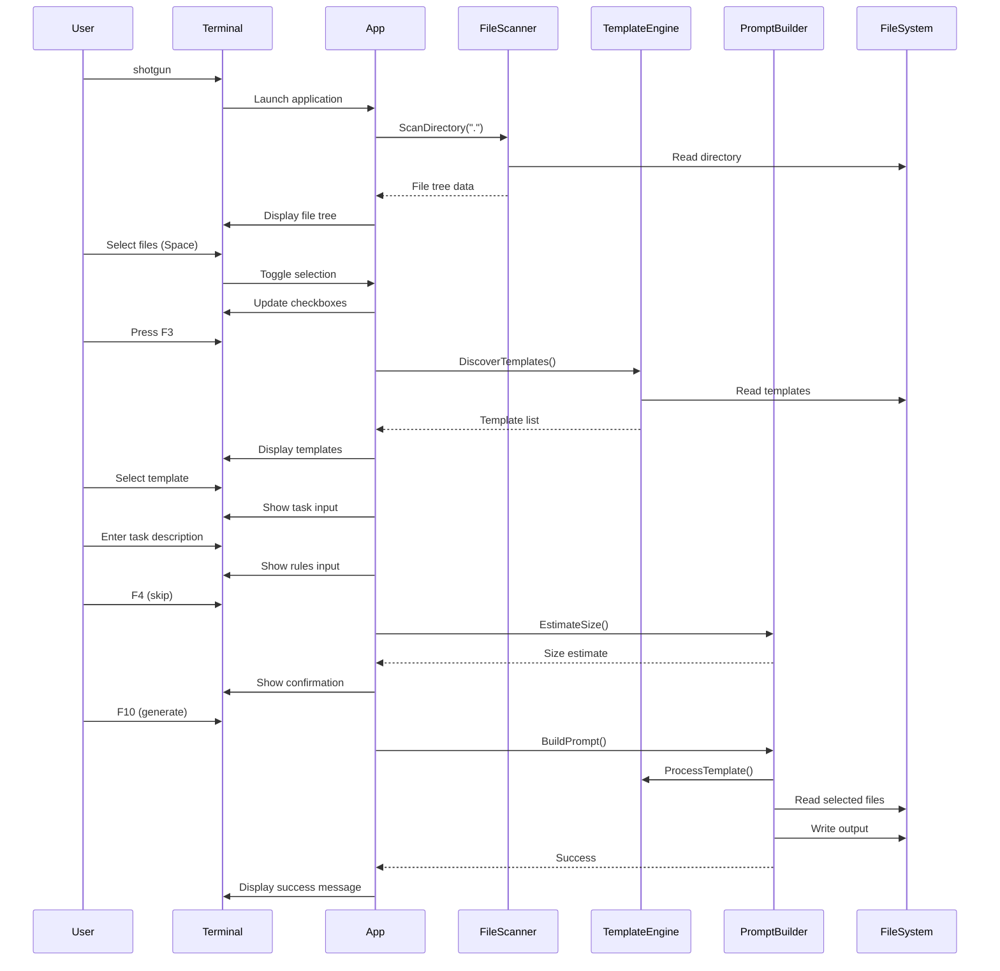

# Core Workflows

```mermaid
sequenceDiagram
    participant User
    participant Terminal
    participant App
    participant FileScanner
    participant TemplateEngine
    participant PromptBuilder
    participant FileSystem
    
    User->>Terminal: shotgun
    Terminal->>App: Launch application
    App->>FileScanner: ScanDirectory(".")
    FileScanner->>FileSystem: Read directory
    FileScanner-->>App: File tree data
    App->>Terminal: Display file tree
    
    User->>Terminal: Select files (Space)
    Terminal->>App: Toggle selection
    App->>Terminal: Update checkboxes
    
    User->>Terminal: Press F3
    App->>TemplateEngine: DiscoverTemplates()
    TemplateEngine->>FileSystem: Read templates
    TemplateEngine-->>App: Template list
    App->>Terminal: Display templates
    
    User->>Terminal: Select template
    App->>Terminal: Show task input
    User->>Terminal: Enter task description
    App->>Terminal: Show rules input
    User->>Terminal: F4 (skip)
    
    App->>PromptBuilder: EstimateSize()
    PromptBuilder-->>App: Size estimate
    App->>Terminal: Show confirmation
    
    User->>Terminal: F10 (generate)
    App->>PromptBuilder: BuildPrompt()
    PromptBuilder->>TemplateEngine: ProcessTemplate()
    PromptBuilder->>FileSystem: Read selected files
    PromptBuilder->>FileSystem: Write output
    PromptBuilder-->>App: Success
    App->>Terminal: Display success message
```
