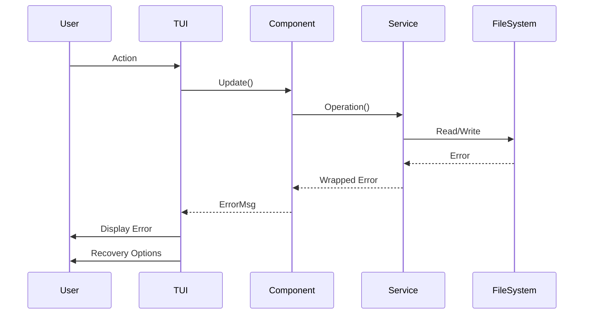

# Error Handling Strategy

## Error Flow



## Error Response Format
```go
type AppError struct {
    Code    string
    Message string
    Details map[string]interface{}
    Wrapped error
}

func (e AppError) Error() string {
    return fmt.Sprintf("[%s] %s", e.Code, e.Message)
}
```

## Frontend Error Handling
```go
func (m Model) handleError(err error) (Model, tea.Cmd) {
    var appErr AppError
    if errors.As(err, &appErr) {
        m.Error = appErr
        m.ShowError = true
        
        // Auto-clear after 3 seconds for non-critical errors
        if appErr.Code != "CRITICAL" {
            return m, tea.Tick(3*time.Second, func(t time.Time) tea.Msg {
                return ClearErrorMsg{}
            })
        }
    }
    return m, nil
}
```

## Backend Error Handling
```go
func (s *Scanner) ScanDirectory(root string) (<-chan FileInfo, error) {
    if _, err := os.Stat(root); err != nil {
        return nil, AppError{
            Code:    "FS_NOT_FOUND",
            Message: "Directory not found",
            Details: map[string]interface{}{"path": root},
            Wrapped: err,
        }
    }
    // ... scan logic
}
```
