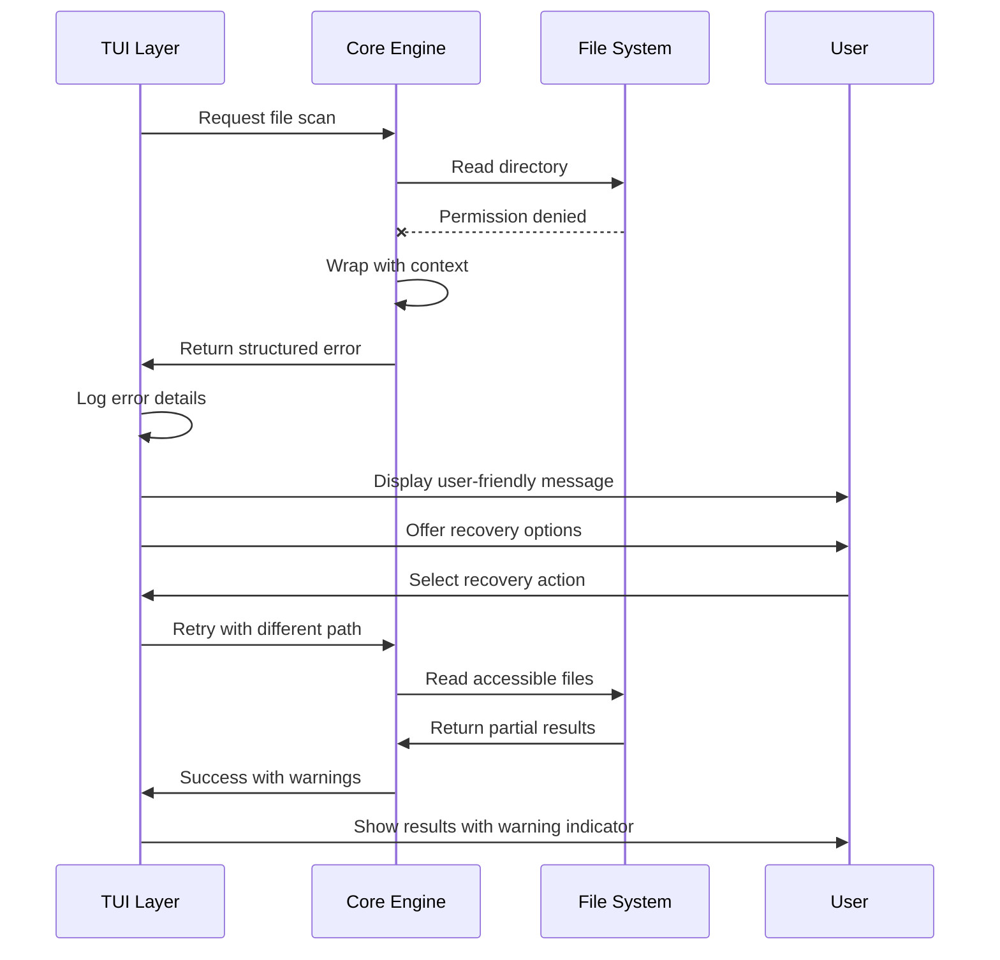

# Error Handling Strategy

### Error Flow



### Error Response Format

```go
// Unified error structure for all application errors
type AppError struct {
    Code        string                 `json:"code"`
    Message     string                 `json:"message"`
    Details     map[string]interface{} `json:"details,omitempty"`
    Timestamp   time.Time              `json:"timestamp"`
    RequestID   string                 `json:"request_id,omitempty"`
    Cause       error                  `json:"-"` // Original error for logging
    Recoverable bool                   `json:"recoverable"`
    Context     string                 `json:"context,omitempty"`
}

func (e *AppError) Error() string {
    return fmt.Sprintf("[%s] %s", e.Code, e.Message)
}

func (e *AppError) Unwrap() error {
    return e.Cause
}

// Error categories for consistent handling
const (
    // File system errors
    ErrCodeFileNotFound     = "FILE_NOT_FOUND"
    ErrCodePermissionDenied = "PERMISSION_DENIED"
    ErrCodeDiskFull         = "DISK_FULL"
    
    // Template errors
    ErrCodeTemplateNotFound    = "TEMPLATE_NOT_FOUND"
    ErrCodeTemplateSyntaxError = "TEMPLATE_SYNTAX_ERROR"
    ErrCodeTemplateTimeout     = "TEMPLATE_TIMEOUT"
    
    // UI errors
    ErrCodeInvalidInput    = "INVALID_INPUT"
    ErrCodeNavigationError = "NAVIGATION_ERROR"
    ErrCodeRenderError     = "RENDER_ERROR"
    
    // System errors
    ErrCodeOutOfMemory = "OUT_OF_MEMORY"
    ErrCodeTimeout     = "TIMEOUT"
    ErrCodeCanceled    = "CANCELED"
)
```

### Frontend Error Handling

```go
// TUI error display and recovery
type ErrorHandler struct {
    logger     *log.Logger
    recovery   map[string]RecoveryAction
    userFacing bool
}

type RecoveryAction struct {
    Description string
    Action      func() tea.Cmd
    Automatic   bool
}

func (eh *ErrorHandler) HandleError(err error, context string) tea.Cmd {
    appErr := eh.wrapError(err, context)
    
    // Log full error details
    eh.logger.Printf("Error [%s]: %s | Context: %s | Details: %+v", 
        appErr.Code, appErr.Message, appErr.Context, appErr.Details)
    
    // Return user-facing command
    if eh.userFacing {
        return eh.createUserMessage(appErr)
    }
    
    return nil
}
```

### Backend Error Handling

```go
// Core processing error handling with context and recovery
type CoreErrorHandler struct {
    logger *log.Logger
    tracer *tracing.Tracer
}

func (ceh *CoreErrorHandler) WrapError(err error, operation string, details map[string]interface{}) *AppError {
    if err == nil {
        return nil
    }
    
    // Check if already an AppError
    var appErr *AppError
    if errors.As(err, &appErr) {
        return appErr
    }
    
    // Create new AppError with context
    appErr = &AppError{
        Code:      ceh.classifyError(err),
        Message:   ceh.sanitizeMessage(err.Error()),
        Details:   details,
        Timestamp: time.Now(),
        RequestID: ceh.generateRequestID(),
        Cause:     err,
        Context:   operation,
        Recoverable: ceh.isRecoverable(err),
    }
    
    return appErr
}
```

