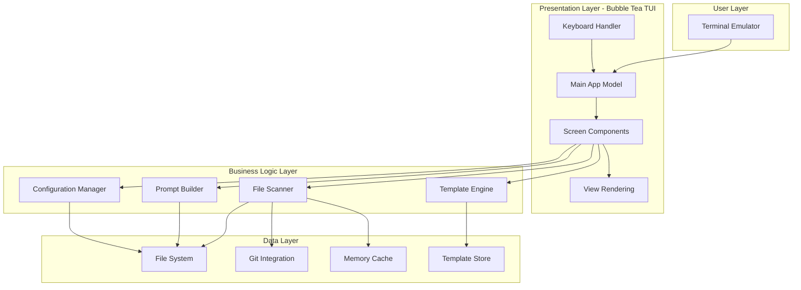

# High Level Architecture

## Technical Summary

Shotgun CLI is a monolithic terminal application built with Go 1.22+ that follows the Elm Architecture pattern through the Bubble Tea TUI framework. The application consists of a presentation layer (TUI components), business logic layer (file scanning, template processing), and data layer (file system operations, configuration management). All processing occurs locally without network dependencies, with concurrent file operations managed through goroutines and channels. The architecture prioritizes keyboard efficiency, cross-platform compatibility, and sub-second response times while maintaining memory usage under 100MB. This design achieves the PRD goals of rapid prompt generation, zero-configuration startup, and seamless terminal integration.

## Platform and Infrastructure Choice

**Platform:** Local execution on user's machine  
**Key Services:** File system access, terminal I/O, process management  
**Deployment Host and Regions:** Distributed as static binaries via GitHub Releases (no cloud infrastructure required)

## Repository Structure

**Structure:** Monorepo  
**Monorepo Tool:** Go modules with internal packages  
**Package Organization:** Single repository with internal packages for components, core logic, and shared utilities

## High Level Architecture Diagram

## Architectural Patterns

- **Elm Architecture:** Single source of truth state management with immutable updates via Bubble Tea - _Rationale:_ Predictable state management crucial for complex TUI interactions
- **Model-View-Update (MVU):** Pure functional updates with command-based side effects - _Rationale:_ Ensures UI consistency and testability in terminal environment
- **Pipeline Pattern:** Stream-based file processing with channels for memory efficiency - _Rationale:_ Handles large repositories without loading everything into memory
- **Repository Pattern:** Abstract file system operations behind interfaces - _Rationale:_ Enables testing and future extensibility for different storage backends
- **Component-Based UI:** Reusable TUI components using Bubbles library - _Rationale:_ Accelerates development and ensures consistent behavior
- **Worker Pool Pattern:** Concurrent file scanning with controlled parallelism - _Rationale:_ Maximizes performance while preventing resource exhaustion
- **Builder Pattern:** Step-by-step prompt construction with validation - _Rationale:_ Ensures all required data is collected before generation
- **Strategy Pattern:** Pluggable template processors for different formats - _Rationale:_ Supports future template engine additions
