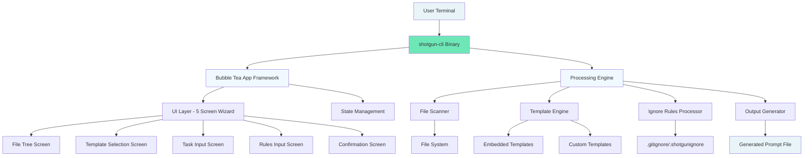

# High Level Architecture

### Technical Summary

shotgun-cli-v3 employs a **monolithic TUI architecture** with concurrent processing capabilities, built as a single Go binary that combines reactive terminal interface management with high-performance file processing. The application uses Bubble Tea's Elm Architecture for predictable state management in the terminal interface while leveraging Go's concurrency primitives (goroutines, channels, worker pools) for efficient file scanning and template processing. The architecture achieves the PRD's performance goals through strategic separation of concerns: the TUI layer handles user interaction and display rendering, while the processing engine manages file discovery, content aggregation, and prompt generation concurrently. Cross-platform compatibility is achieved through Go's native compilation and the Charm ecosystem's proven terminal abstraction, enabling deployment as a single executable across Windows, Linux, and macOS without runtime dependencies.

### Platform and Infrastructure Choice

For a Go TUI application, the "infrastructure" primarily concerns cross-platform binary distribution and terminal compatibility rather than cloud services:

**Platform:** GitHub Releases + Cross-Platform Native Binaries  
**Key Services:** GitHub Actions (CI/CD), GitHub Releases (Distribution), Go Cross-Compilation  
**Deployment Regions:** Global (binary downloads), Cross-Platform (Windows, Linux, macOS)

### Repository Structure

Given the monolithic nature of the TUI application and the PRD's emphasis on a single binary, a **standard Go project structure** is most appropriate:

**Structure:** Single repository with standard Go project layout  
**Monorepo Tool:** Not applicable - standard Go modules  
**Package Organization:** Internal packages for domain separation (ui/, scanner/, templates/, etc.)

### High Level Architecture Diagram

### Architectural Patterns

- **Elm Architecture (TEA):** Reactive UI state management through Bubble Tea - _Rationale:_ Predictable state updates and excellent testing capabilities for complex TUI workflows
- **Command Pattern:** Screen navigation and user actions as discrete commands - _Rationale:_ Enables undo/redo functionality and clean separation of UI concerns from business logic  
- **Worker Pool Pattern:** Concurrent file processing with bounded concurrency - _Rationale:_ Optimal performance for file scanning while preventing resource exhaustion on large repositories
- **Template Method Pattern:** Pluggable template processing with consistent pipeline - _Rationale:_ Supports both embedded and custom templates with unified processing logic
- **Repository Pattern:** Abstract file system operations for testing and flexibility - _Rationale:_ Enables comprehensive testing without file system dependencies and future storage backends
- **Pipeline Pattern:** Sequential processing stages for prompt generation - _Rationale:_ Clear separation of concerns from file discovery through final output generation

