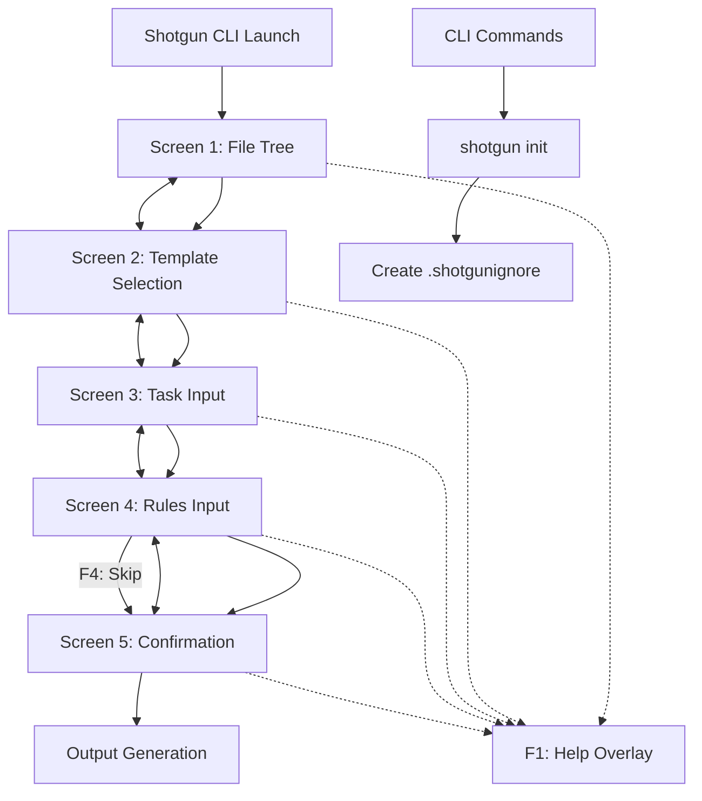
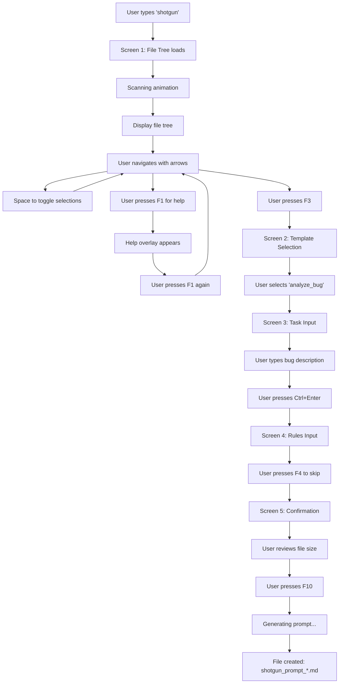
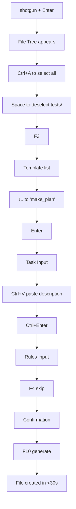

# Shotgun CLI UI/UX Specification

## Introduction

This document defines the user experience goals, information architecture, user flows, and visual design specifications for Shotgun CLI's terminal user interface. It serves as the foundation for visual design and frontend development, ensuring a cohesive and user-centered experience.

### Overall UX Goals & Principles

#### Target User Personas

**Power Developer**
- Senior developers and tech leads who use LLMs daily for code analysis and review
- Extremely keyboard-proficient, expects vim-like efficiency
- Values speed and consistency over visual appeal
- Needs: Quick navigation, muscle memory support, batch operations

**Team Developer**  
- Mid-level developers working in collaborative environments
- Comfortable with CLI tools but appreciates clear guidance
- Uses LLMs for debugging and documentation tasks
- Needs: Clear visual feedback, intuitive patterns, error recovery

**CLI-Curious Developer**
- Developers new to terminal-based workflows or LLMs
- May be transitioning from GUI tools
- Needs extensive help and clear visual hierarchy
- Needs: Discoverable features, clear instructions, forgiving interface

#### Usability Goals

- **Efficiency of Use**: Complete prompt generation in under 2 minutes for experienced users
- **Ease of Learning**: New users successfully generate first prompt within 5 minutes
- **Error Prevention**: Visual indicators prevent selection of binary files and invalid states
- **Memorability**: F-key navigation and consistent patterns allow quick relearning after breaks
- **Satisfaction**: Smooth animations and responsive feedback create delightful interaction

#### Design Principles

1. **Keyboard-First Excellence** - Every action optimized for keyboard efficiency with zero mouse dependency
2. **Progressive Disclosure** - Show file tree first, reveal complexity only as needed through the 5-screen flow
3. **Visual Hierarchy Through Minimalism** - Use spacing, borders, and subtle color to guide attention
4. **Immediate Feedback** - Every keystroke provides instant visual confirmation (checkbox toggles, cursor movement)
5. **Graceful Degradation** - Maintain full functionality even in basic terminals, enhance for capable ones

### Change Log

| Date | Version | Description | Author |
|------|---------|-------------|--------|
| 2025-09-02 | v1.0 | Initial UI/UX specification from PRD | Sally (UX Expert) |

## Information Architecture (IA)

### Site Map / Screen Inventory



### Navigation Structure

**Primary Navigation:** Linear wizard flow through 5 screens using F2 (back) and F3 (forward) keys. Each screen represents a distinct step in the prompt generation process, with state preservation allowing free movement between completed screens.

**Secondary Navigation:** Within-screen navigation using arrow keys, space for selection, and enter for confirmation. Context-sensitive shortcuts (e.g., Ctrl+A for select all in file tree, Ctrl+Enter to finish text input).

**Breadcrumb Strategy:** Visual progress indicator showing [1/5], [2/5], etc. in the header, with the current screen title. No clickable breadcrumbs as this is keyboard-only interface.

## User Flows

### Flow: Generate First Prompt (New User)

**User Goal:** Successfully generate a prompt for bug analysis within 5 minutes of first use

**Entry Points:** Terminal command `shotgun` in project directory

**Success Criteria:** User generates prompt file, understands the process, feels confident to use again

#### Flow Diagram



#### Edge Cases & Error Handling:
- Empty directory: Show message "No files found in current directory"
- All files ignored: Warning "All files are ignored. Check .gitignore settings"
- No template selected: F3 disabled until selection made
- Empty task input: F3 disabled with hint "Task description required"
- Large output warning: Yellow warning if >500KB with option to go back

**Notes:** First-time users will likely use F1 frequently. The help overlay must be comprehensive yet concise.

### Flow: Power User Speed Run

**User Goal:** Generate prompt in under 30 seconds using keyboard shortcuts

**Entry Points:** Terminal command `shotgun` with muscle memory

**Success Criteria:** Minimal keystrokes, no hesitation, immediate generation

#### Flow Diagram



#### Edge Cases & Error Handling:
- Clipboard paste with invalid UTF-8: Sanitize and accept valid characters
- Muscle memory errors: Allow Ctrl+Z undo in text fields

**Notes:** Power users will appreciate shortcuts like Ctrl+A, batch operations, and vim-like navigation in future versions.

## Wireframes & Mockups

### Design Files

**Primary Design Files:** ASCII-based mockups embedded in documentation (terminal UI has no traditional design files)

### Key Screen Layouts

#### Screen 1: File Tree Selection

**Purpose:** Allow users to select which files/folders to include in the prompt

**Key Elements:**
- Header with title "File Selection" and progress [1/5]
- Tree view with checkboxes [✓] for selected, [ ] for unselected
- Status bar showing "X selected • Y excluded • Z ignored"
- Footer with keyboard shortcuts

**Interaction Notes:** Space toggles current item, arrows navigate, right/left expand/collapse folders. All items start selected by default.

**Design File Reference:** See PLAN.md lines 375-399 for detailed ASCII mockup

```
 shotgun-cli                                      
 File Selection                          [1/5]    
 ━━━━━━────────────────────────────────          

 [✓] README.md                                    
 [✓] go.mod                                       
 [✓] PLAN.md                                      
 [✓] cmd/                               ▸        
 [ ] tests/                             ▸        
 [✓] internal/                          ▾        
   └ [✓] app/                                   
       [✓] app.go                               
       [✓] model.go                             

 8 selected · 1 excluded · 12 ignored            

 Space toggle · ←→ expand · ↑↓ navigate          
 F3 next · ESC exit                              
```

#### Screen 2: Template Selection

**Purpose:** Choose from available prompt templates

**Key Elements:**
- Header with title "Template Selection" and progress [2/5]
- List view with template name, version, and description
- Highlighted selection bar
- Footer with navigation hints

**Interaction Notes:** Arrow keys to navigate, Enter or F3 to select. Current selection highlighted with accent color.

**Design File Reference:** See PLAN.md lines 402-424 for detailed ASCII mockup

#### Screen 3: Task Input

**Purpose:** Capture detailed task description from user

**Key Elements:**
- Header with "Task Description" and progress [3/5]
- Mode indicator showing "editing"
- Large text area with border
- Character/line count
- Footer with Ctrl+Enter to finish

**Interaction Notes:** Full text editing capabilities, support for paste, word wrap enabled.

**Design File Reference:** See PLAN.md lines 427-452 for detailed ASCII mockup

#### Screen 4: Rules Input (Optional)

**Purpose:** Allow optional rules/constraints input

**Key Elements:**
- Header with "Rules · optional" and progress [4/5]
- Mode indicator
- Text area (similar to Task Input)
- Clear "optional field" indicator
- Footer includes F4 to skip

**Interaction Notes:** Similar to Task Input but with skip option prominently displayed.

**Design File Reference:** See PLAN.md lines 454-473 for detailed ASCII mockup

#### Screen 5: Confirmation

**Purpose:** Review selections and confirm generation

**Key Elements:**
- Summary section with template, file count, exclusions
- Output filename display
- Size estimate with progress bar
- Warning if file is large
- F10 to generate prominently shown

**Interaction Notes:** Read-only screen, only navigation is back (F2) or generate (F10).

**Design File Reference:** See PLAN.md lines 476-498 for detailed ASCII mockup

## Component Library / Design System

### Design System Approach

**Design System Approach:** Custom minimalist component system built with Lip Gloss styling library, optimized for terminal constraints. Components follow consistent patterns for keyboard interaction, visual feedback, and state management.

### Core Components

#### Tree Component

**Purpose:** Display hierarchical file structure with selection capability

**Variants:** Standard (with checkboxes), Read-only (for display), Filtered (showing search results)

**States:** Default, Focused, Selected, Disabled (for binary files), Collapsed, Expanded

**Usage Guidelines:** Always show selection state clearly, use consistent indentation (2 spaces per level), provide visual distinction for folders vs files

#### Text Input Component

**Purpose:** Capture single or multiline text input from users

**Variants:** Single-line (for search), Multiline (for task/rules), Read-only (for display)

**States:** Default, Focused, Editing, Error, Disabled

**Usage Guidelines:** Always show cursor position, support standard text editing shortcuts, provide clear boundaries with borders

#### List Component

**Purpose:** Display selectable list of items (templates, options)

**Variants:** Simple (text only), Detailed (with descriptions), Numbered (with indices)

**States:** Default, Focused item, Selected item, Disabled item

**Usage Guidelines:** Highlight current selection clearly, show metadata inline, maintain consistent spacing

#### Progress Component

**Purpose:** Show progress during operations

**Variants:** Indeterminate (spinner), Determinate (progress bar), Step indicator ([1/5])

**States:** Idle, Active, Complete, Error

**Usage Guidelines:** Use for operations >500ms, provide context text, ensure smooth animations

#### Status Bar Component

**Purpose:** Display contextual information and hints

**Variants:** Info (neutral), Success (green), Warning (yellow), Error (red)

**States:** Default, Updating (with fade animation)

**Usage Guidelines:** Keep messages concise, auto-clear success messages after 3s, persist errors until resolved

## Branding & Style Guide

### Visual Identity

**Brand Guidelines:** Minimalist developer-focused aesthetic emphasizing functionality over decoration

### Color Palette

| Color Type | Hex Code | Usage |
|------------|----------|--------|
| Primary | #6ee7b7 | Selected items, active borders, progress indicators |
| Secondary | #fbbf24 | Warnings, highlights, important notices |
| Accent | #86efac | Success states, confirmations |
| Success | #86efac | Successful operations, completed states |
| Warning | #fde047 | Large files, potential issues |
| Error | #fca5a5 | Error messages, invalid states |
| Neutral | #e8e8e8, #808080, #505050, #2a2a2a | Text, borders, backgrounds (various shades) |

### Typography

#### Font Families
- **Primary:** System monospace font
- **Secondary:** System monospace font (no variation in TUI)
- **Monospace:** System default terminal font

#### Type Scale

| Element | Size | Weight | Line Height |
|---------|------|--------|-------------|
| H1 | Terminal default | Bold (if supported) | 1.0 |
| H2 | Terminal default | Normal | 1.0 |
| H3 | Terminal default | Normal | 1.0 |
| Body | Terminal default | Normal | 1.0 |
| Small | Terminal default | Dim (color-based) | 1.0 |

### Iconography

**Icon Library:** ASCII characters only (✓, ▸, ▾, └, ├, │, ━, ▌)

**Usage Guidelines:** Use sparingly for checkboxes, tree structure, and borders. Ensure fallback to basic ASCII (-, +, *, |) for limited terminals.

### Spacing & Layout

**Grid System:** Character-based grid, typically 80 columns wide minimum

**Spacing Scale:** 
- Inline: 1 space
- Between elements: 1 empty line  
- Section padding: 2 spaces from border
- Indentation: 2 spaces per level

## Accessibility Requirements

### Compliance Target

**Standard:** Section 508 compliance with WCAG 2.1 AA guidelines adapted for terminal interfaces

### Key Requirements

**Visual:**
- Color contrast ratios: Minimum 4.5:1 for normal text, 3:1 for large text
- Focus indicators: Clear cursor position, highlighted selections with border changes
- Text sizing: Respects terminal font size settings, no hardcoded sizes

**Interaction:**
- Keyboard navigation: 100% keyboard accessible, no mouse required
- Screen reader support: Structured output compatible with terminal screen readers
- Touch targets: N/A for terminal application

**Content:**
- Alternative text: Status messages announce state changes
- Heading structure: Clear hierarchical organization with screen titles
- Form labels: Every input clearly labeled with purpose

### Testing Strategy

Test with multiple terminal emulators (Terminal.app, iTerm2, Windows Terminal, PuTTY), verify with screen readers (NVDA, JAWS), ensure color-blind friendly palette, test with keyboard-only navigation

## Responsiveness Strategy

### Breakpoints

| Breakpoint | Min Width | Max Width | Target Devices |
|------------|-----------|-----------|----------------|
| Narrow | 0 | 79 chars | Small terminal windows, mobile SSH |
| Standard | 80 | 119 chars | Default terminal size |
| Wide | 120 | 199 chars | Full-screen terminals |
| Ultra-wide | 200 | - | Multiple monitor setups |

### Adaptation Patterns

**Layout Changes:** Tree view collapses to show only filenames in narrow mode, template descriptions hide in narrow mode

**Navigation Changes:** Help text truncates to essential keys only in narrow mode

**Content Priority:** File names and selections always visible, metadata and descriptions first to hide

**Interaction Changes:** No interaction changes, keyboard commands consistent across all sizes

## Animation & Micro-interactions

### Motion Principles

Subtle and purposeful animations that provide feedback without distraction. All animations respect terminal refresh rates and degrade gracefully on slow connections.

### Key Animations

- **Checkbox Toggle:** Instant change with no animation (Duration: 0ms, Easing: none)
- **Selection Move:** Smooth cursor movement between items (Duration: 50ms, Easing: ease-out)
- **Tree Expand/Collapse:** Gentle slide animation for child items (Duration: 100ms, Easing: ease-in-out)
- **Screen Transition:** Fade between screens (Duration: 150ms, Easing: ease-in-out)
- **Progress Bar:** Smooth fill animation (Duration: continuous, Easing: linear)
- **Loading Spinner:** Rotating animation using ASCII characters (Duration: 100ms per frame, Easing: linear)

## Performance Considerations

### Performance Goals

- **Page Load:** <100ms to display first screen
- **Interaction Response:** <16ms for keyboard input feedback
- **Animation FPS:** 30fps minimum for smooth animations

### Design Strategies

Implement virtual scrolling for file trees over 100 items, lazy load template descriptions, use debouncing for rapid keyboard input, pre-calculate layout to avoid reflows, cache rendered components when possible

## Next Steps

### Immediate Actions

1. Review specification with development team for technical feasibility
2. Create test plan for keyboard navigation patterns
3. Prototype critical interactions in Bubble Tea framework
4. Validate color palette across different terminal emulators
5. Document keyboard shortcut reference card

### Design Handoff Checklist

- [x] All user flows documented
- [x] Component inventory complete
- [x] Accessibility requirements defined
- [x] Responsive strategy clear
- [x] Brand guidelines incorporated
- [x] Performance goals established

## Checklist Results

_UI/UX checklist to be run post-review_