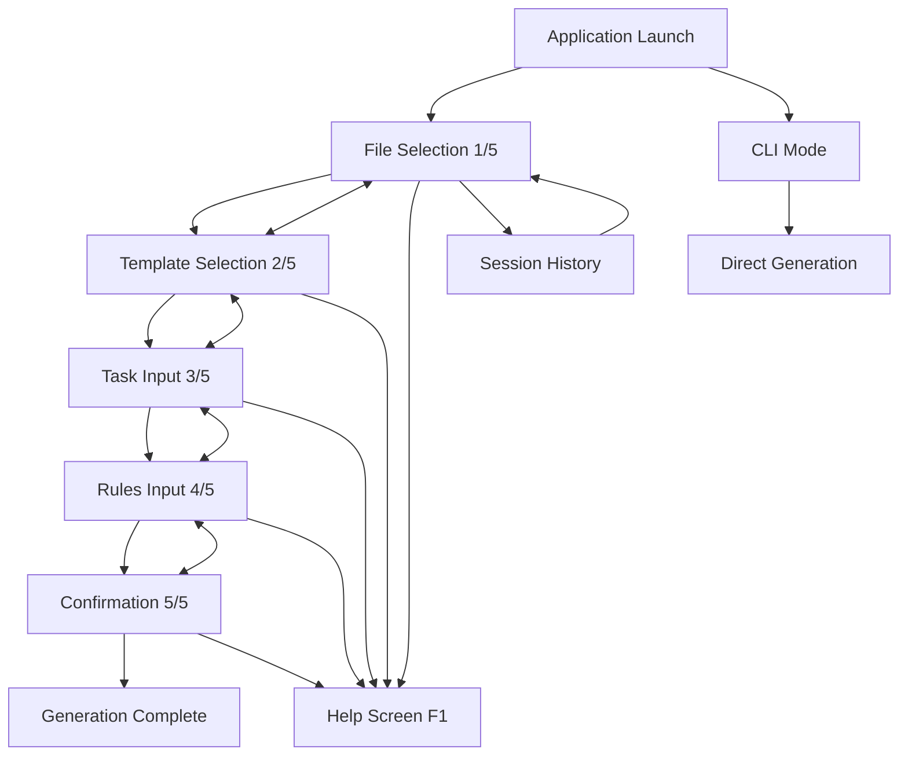
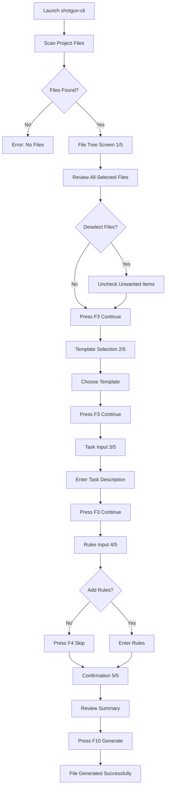
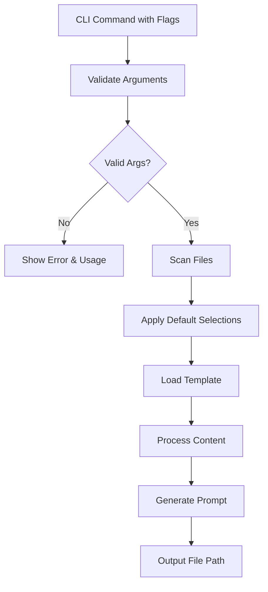
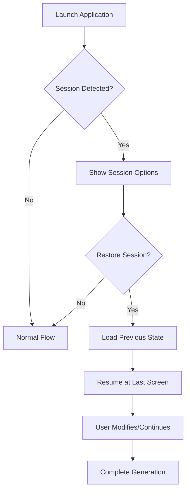

# shotgun-cli-v3 UI/UX Specification

## Introduction

This document defines the user experience goals, information architecture, user flows, and visual design specifications for **shotgun-cli-v3**'s terminal user interface. This TUI application generates standardized LLM prompts from templates with project file context integration. The specification serves as the foundation for visual design and frontend development, ensuring a cohesive, keyboard-first experience optimized for professional developers who value speed and workflow efficiency.

### Overall UX Goals & Principles

#### Target User Personas

**Power User - Senior Developer:** Technical professionals who work with multiple large codebases daily, need advanced features like session management and performance optimization, value keyboard shortcuts and workflow efficiency over visual polish.

**Casual User - Occasional Developer:** Developers who use LLM prompts periodically for code analysis or debugging, prioritize clear guidance and intuitive navigation, need the tool to "just work" without extensive configuration.

**Team Lead - Technical Manager:** System managers who need to standardize team workflows, require consistent prompt generation across team members, value reproducible results and integration capabilities.

#### Usability Goals

- **Instant Productivity:** New users complete their first prompt generation within 2 minutes of launch
- **Keyboard Mastery:** Power users navigate entire workflow using only F-keys and arrow keys with <5 keystrokes per major action  
- **Large Project Efficiency:** Handle 1000+ file repositories with <5 second scanning and responsive UI throughout
- **Error Prevention:** Clear validation prevents invalid selections, with contextual help available via F1 on every screen
- **Session Continuity:** Users can resume interrupted workflows and repeat previous configurations seamlessly

#### Design Principles

1. **Keyboard-First Philosophy** - Every interaction optimized for keyboard users with global shortcuts and no mouse dependency
2. **Progressive Disclosure** - Show essential information immediately, reveal complexity only when needed through the 5-screen wizard flow
3. **Professional Minimalism** - Clean monochrome aesthetic that works across all terminal environments without distraction
4. **Immediate Visual Feedback** - Every user action provides instant visual confirmation through progress bars, counters, and state indicators
5. **Performance Transparency** - Always show what the system is doing with real-time progress and size estimates

#### Change Log
| Date | Version | Description | Author |
|------|---------|-------------|--------|
| 2024-03-15 | 1.0 | Initial UI/UX specification creation | Sally (UX Expert) |

## Information Architecture (IA)

### Site Map / Screen Inventory



### Navigation Structure

**Primary Navigation:** 
Linear wizard progression with bidirectional flow between screens. F2 (back), F3 (forward) provide consistent navigation, while F1 (help) and ESC (exit) serve as global escape routes. Progress indicator [X/5] maintains spatial awareness throughout workflow.

**Secondary Navigation:** 
Screen-specific shortcuts adapt to current context - Space (toggle selection), Enter (confirm), Ctrl+A (select all) in file tree; arrow keys and Enter in template selection; Ctrl+Enter (mode toggle) in text editors. Each screen provides contextual shortcuts optimized for its primary task.

**Breadcrumb Strategy:** 
Progress indicator serves as breadcrumb showing current position in 5-screen sequence. No traditional breadcrumbs needed due to linear workflow, but screen headers include descriptive titles (e.g., "File Selection [1/5]", "Task Description [3/5]") for clear orientation.

## User Flows

### Primary Flow: Generate LLM Prompt (Interactive Mode)

**User Goal:** Generate a customized LLM prompt with project context for code analysis, debugging, or planning tasks

**Entry Points:** Command line execution (`shotgun-cli`) in project directory

**Success Criteria:** Timestamped Markdown file created with complete prompt ready for LLM consumption

#### Flow Diagram


#### Edge Cases & Error Handling:
- **No files found:** Display error message with suggestion to check directory or .gitignore rules
- **No template selected:** Prevent F3 navigation with visual indication of required selection
- **Empty task description:** Block progression with validation message requiring task input
- **File write permissions:** Handle gracefully with clear error message and alternative save location suggestion
- **Very large prompt size (>1MB):** Warning dialog with option to continue or reduce file selection
- **Interrupted generation:** Auto-save session state for recovery on next launch

**Notes:** This flow represents 90% of user interactions and must be optimized for speed and reliability.

### Secondary Flow: Quick CLI Generation

**User Goal:** Generate prompt directly via command line for automation or repeated workflows

**Entry Points:** Command line with flags (`shotgun-cli --template analyze_bug --task "Debug memory leak"`)

**Success Criteria:** Prompt generated without interactive interface, suitable for CI/CD integration

#### Flow Diagram


#### Edge Cases & Error Handling:
- **Invalid template name:** List available templates with suggestion
- **Missing required flags:** Show contextual help with required parameters
- **File system errors:** Graceful fallback with detailed error messaging

**Notes:** Designed for power users and automation scenarios requiring no interactive input.

### Tertiary Flow: Session Recovery

**User Goal:** Resume interrupted workflow or repeat previous configuration with modifications

**Entry Points:** Launch application with previous session detected, or explicit session selection

**Success Criteria:** Previous selections restored, allowing user to modify and complete workflow

#### Flow Diagram


#### Edge Cases & Error Handling:
- **Corrupted session data:** Fall back to normal flow with notification
- **Files changed since session:** Highlight modified/missing files with options to refresh
- **Template no longer available:** Prompt for new template selection

**Notes:** Critical for user productivity and workflow continuity after interruptions.

## Wireframes & Mockups

**Primary Design Files:** Terminal-based ASCII wireframes and layout specifications (no external design tool needed for TUI application)

### Key Screen Layouts

#### File Selection Screen [1/5]

**Purpose:** Allow users to review and deselect files from the all-selected default state

**Key Elements:**
- Header with title and progress indicator `File Selection [1/5]`
- ASCII file tree with checkbox states `[✓]`, `[ ]`, `[◐]`
- Tree navigation symbols `├── └── │` for hierarchy
- Status bar showing `X selected · Y excluded · Z ignored`
- Footer with keyboard shortcuts `F1-Help F2-Back F3-Next ESC-Exit`

**Interaction Notes:** Space toggles selection, arrow keys navigate, hierarchical selection affects children, Ctrl+A/Ctrl+I for batch operations

**Design File Reference:** ASCII Layout Specification (TUI-specific)

```
┌─ shotgun-cli v3 ────────────────────────────────────────────┐
│ File Selection [1/5]                                        │
├─────────────────────────────────────────────────────────────┤
│ ├── [✓] src/                                               │
│ │   ├── [✓] main.go                                        │
│ │   ├── [✓] handlers/                                      │
│ │   │   └── [✓] file_scanner.go                           │
│ │   └── [◐] ui/                                           │
│ │       ├── [✓] screens.go                                │
│ │       └── [ ] debug.go                                  │
│ ├── [✓] templates/                                         │
│ │   └── [✓] analyze_bug.tmpl                              │
│ └── [ ] README.md                                          │
├─────────────────────────────────────────────────────────────┤
│ 127 selected · 3 excluded · 45 ignored                     │
│ F1-Help F2-Back F3-Next ESC-Exit                           │
└─────────────────────────────────────────────────────────────┘
```

#### Template Selection Screen [2/5]

**Purpose:** Present available templates with descriptions for user selection

**Key Elements:**
- Header with progress `Template Selection [2/5]`
- Vertical list of templates with highlighting
- Template metadata (name, version, description)
- Selection indicator for current choice
- Navigation shortcuts in footer

**Interaction Notes:** Arrow keys navigate list, Enter or F3 selects and advances, F1 shows template preview

**Design File Reference:** ASCII Layout Specification (TUI-specific)

```
┌─ shotgun-cli v3 ────────────────────────────────────────────┐
│ Template Selection [2/5]                                    │
├─────────────────────────────────────────────────────────────┤
│ → analyze_bug v1.2                                         │
│   Debug and analyze code issues with context               │
│                                                             │
│   make_diff v1.0                                           │
│   Generate code changes and improvements                    │
│                                                             │
│   make_plan v1.1                                           │
│   Create project plans and feature specifications          │
│                                                             │
│   project_manager v1.0                                     │
│   Comprehensive project analysis and recommendations       │
├─────────────────────────────────────────────────────────────┤
│ ↑↓-Navigate Enter/F3-Select F1-Preview F2-Back ESC-Exit    │
└─────────────────────────────────────────────────────────────┘
```

#### Task Input Screen [3/5]

**Purpose:** Capture detailed task description with full UTF-8 support

**Key Elements:**
- Header with progress `Task Description [3/5]`
- Large multiline text editor area
- Character/word count display
- Mode indicator (Editing/Navigation)
- Scrolling support for long text

**Interaction Notes:** Ctrl+Enter toggles edit/navigation mode, clipboard support with Ctrl+C/V, word wrap and line numbers

**Design File Reference:** ASCII Layout Specification (TUI-specific)

```
┌─ shotgun-cli v3 ────────────────────────────────────────────┐
│ Task Description [3/5]                    Mode: Editing     │
├─────────────────────────────────────────────────────────────┤
│ 1│ I need help debugging a memory leak in the file        │
│ 2│ scanner component. The application consumes            │
│ 3│ increasing amounts of RAM when processing large        │
│ 4│ repositories, particularly those with 1000+ files.     │
│ 5│ The leak seems to occur during concurrent file         │
│ 6│ processing...                                           │
│ 7│ █                                                       │
│  │                                                         │
│  │                                                         │
├─────────────────────────────────────────────────────────────┤
│ 312 chars · 52 words                                       │
│ Ctrl+Enter-Mode F1-Help F2-Back F3-Next ESC-Exit          │
└─────────────────────────────────────────────────────────────┘
```

#### Confirmation Screen [5/5]

**Purpose:** Final review and generation trigger with comprehensive summary

**Key Elements:**
- Header with progress `Confirm Generation [5/5]`
- Summary of all selections and inputs
- Size estimation with progress bar
- Warning indicators for large prompts
- Clear action buttons for generation

**Interaction Notes:** F10 generates prompt, F2 allows changes, visual warnings for size issues

**Design File Reference:** ASCII Layout Specification (TUI-specific)

```
┌─ shotgun-cli v3 ────────────────────────────────────────────┐
│ Confirm Generation [5/5]                                    │
├─────────────────────────────────────────────────────────────┤
│ Template: analyze_bug v1.2                                  │
│ Files: 127 selected (src/, templates/)                      │
│ Task: I need help debugging a memory leak...                │
│ Rules: Focus on concurrent processing patterns              │
│                                                             │
│ Estimated Size: ████████▒▒ 845 KB                          │
│ ⚠ Large prompt - consider reducing file selection          │
│                                                             │
│ Output: shotgun_prompt_20240315_1425.md                    │
├─────────────────────────────────────────────────────────────┤
│ F2-Make Changes F10-Generate ESC-Cancel                     │
└─────────────────────────────────────────────────────────────┘
```

## Component Library / Design System

**Design System Approach:** Custom TUI component library built on Bubble Tea v2.0.0-beta.4 and Bubbles v0.21.0, extending base components with project-specific styling and behavior patterns. Focuses on consistent keyboard navigation, monochrome aesthetics, and cross-platform terminal compatibility.

### Core Components

#### Screen Container

**Purpose:** Standardized layout wrapper for all wizard screens with consistent header, content area, and footer

**Variants:** 
- Standard (File Tree, Template Selection)
- Editor (Task Input, Rules Input) 
- Summary (Confirmation Screen)

**States:** Loading, Active, Error, Help Overlay

**Usage Guidelines:** All screens must use Screen Container for consistent spacing, borders, and keyboard shortcut display. Header always shows progress [X/5], footer always shows relevant F-key shortcuts.

#### File Tree Widget

**Purpose:** Hierarchical file browser with checkbox selection states and keyboard navigation

**Variants:**
- Compact (for smaller terminals)
- Detailed (with file sizes and modification dates)
- Performance (virtual scrolling for large repos)

**States:** 
- Items: Checked [✓], Unchecked [ ], Partial [◐], Ignored (grayed)
- Tree: Expanded, Collapsed, Loading, Error

**Usage Guidelines:** Always start with all-selected state. Use hierarchical selection logic where parent selection affects all children. Provide visual feedback for ignored files (.gitignore/.shotgunignore).

#### Template List Selector

**Purpose:** Vertical list component for template selection with metadata display

**Variants:**
- Standard (name + description)
- Detailed (+ version, author, tags)

**States:** Focused, Selected, Loading, Error (template validation failed)

**Usage Guidelines:** Highlight current selection with accent color. Show template metadata below name. Support preview mode via additional key press.

#### Multiline Text Editor

**Purpose:** Advanced text input component with UTF-8 support and editing modes

**Variants:**
- Task Editor (required input)
- Rules Editor (optional input with skip capability)

**States:** 
- Mode: Editing, Navigation
- Content: Empty, Valid, Character Limit Warning
- Focus: Active, Inactive

**Usage Guidelines:** Ctrl+Enter toggles between editing and navigation modes. Show character/word counts. Support clipboard operations. Indicate required vs optional fields clearly.

#### Progress Indicator

**Purpose:** Visual feedback component for size estimation and loading operations

**Variants:**
- Bar Progress (horizontal bar with percentage)
- Size Estimator (with warning thresholds)
- Loading Spinner (for file scanning)

**States:** Normal, Warning (>500KB), Critical (>1MB), Error

**Usage Guidelines:** Use accent colors for progress visualization. Show warnings for large prompts. Animate smoothly during updates.

#### Status Bar

**Purpose:** Information display component showing counts, selections, and system status

**Variants:**
- File Status (selected/excluded/ignored counts)
- System Status (memory usage, file scan progress)
- Help Status (contextual keyboard shortcuts)

**States:** Normal, Warning, Error, Help

**Usage Guidelines:** Always visible at screen bottom. Use consistent formatting for counts and status messages. Show most relevant information for current screen context.

#### Modal Dialog

**Purpose:** Overlay component for confirmations, help screens, and error messages

**Variants:**
- Help Dialog (F1 contextual help)
- Confirmation Dialog (exit confirmation)
- Error Dialog (with recovery options)

**States:** Open, Closed, Loading

**Usage Guidelines:** Center on screen with clear borders. ESC always closes dialog. Provide clear action options (OK/Cancel). Keep content concise for terminal display.

## Branding & Style Guide

### Visual Identity

**Brand Guidelines:** Early 1900s-inspired monochrome terminal aesthetic emphasizing professionalism, timelessness, and universal compatibility across all terminal environments. Clean typography with minimal visual elements using ASCII art borders and restrained color palette.

### Color Palette

| Color Type | Hex Code | Usage |
|------------|----------|-------|
| Primary | `#ffffff` | Main text, borders, primary UI elements |
| Secondary | `#808080` | Secondary text, inactive states, subtle borders |
| Accent | `#6ee7b7` | Focus states, selection highlights, progress indicators |
| Success | `#10b981` | Successful operations, completed states |
| Warning | `#fbbf24` | Large file warnings, attention indicators |
| Error | `#ef4444` | Error states, validation failures |
| Neutral | `#1f2937`, `#374151`, `#6b7280` | Backgrounds, ignored files, disabled states |

### Typography

#### Font Families
- **Primary:** System monospace font (Consolas, Monaco, 'Courier New')
- **Secondary:** Not applicable (terminal uses single font family)
- **Monospace:** Default terminal monospace (all text inherits this)

#### Type Scale

| Element | Size | Weight | Line Height |
|---------|------|---------|-------------|
| H1 | Terminal default | Bold (bright) | 1.0 |
| H2 | Terminal default | Bold (bright) | 1.0 |
| H3 | Terminal default | Normal | 1.0 |
| Body | Terminal default | Normal | 1.0 |
| Small | Terminal default | Dim | 1.0 |

### Iconography

**Icon Library:** ASCII character-based iconography using standard terminal symbols

**Usage Guidelines:** 
- `[✓]` `[ ]` `[◐]` for checkbox states
- `├── └── │` for tree hierarchy
- `→` for selection indicators  
- `█▓▒░` for progress bars
- `⚠` for warnings, `✗` for errors, `✓` for success
- Folder icons: `📁` where Unicode supported, `[DIR]` for fallback

### Spacing & Layout

**Grid System:** Character-based grid using terminal columns and rows. Minimum 80x24 terminal support with responsive scaling for larger displays.

**Spacing Scale:** 
- Minimal: 1 character space
- Standard: 2 character spaces  
- Section: 1 row separation
- Screen: 2 row separation
- Component padding: 1 character internal, 2 character external

## Accessibility Requirements

### Compliance Target

**Standard:** WCAG 2.1 AA compliance for terminal-based applications with full keyboard navigation and screen reader compatibility

### Key Requirements

**Visual:**
- Color contrast ratios: Minimum 4.5:1 for normal text, 3:1 for large text, tested across light/dark terminal themes
- Focus indicators: High-contrast accent color (#6ee7b7) with consistent visual highlighting for current selection
- Text sizing: Respects user's terminal font size settings, scalable with system accessibility preferences

**Interaction:**
- Keyboard navigation: 100% keyboard operation with no mouse dependency, logical tab order through all interactive elements
- Screen reader support: Semantic text structure with meaningful state descriptions ("checked", "expanded", "3 of 127 files selected")
- Touch targets: N/A (terminal interface), all interactions via keyboard with standard key sizes

**Content:**
- Alternative text: Descriptive state information for all UI elements ("File tree showing 127 items, 3 selected")
- Heading structure: Logical heading hierarchy using screen titles and section headers
- Form labels: Clear labeling for all input fields ("Task Description (required)", "Rules (optional)")

### Testing Strategy

**Automated Testing:**
- Color contrast validation using terminal color testing tools
- Keyboard navigation testing with automated key sequence validation
- Screen reader compatibility testing using NVDA/JAWS simulation

**Manual Testing:**
- Cross-platform testing on Windows (Narrator), macOS (VoiceOver), Linux (Orca)
- High contrast mode testing across terminal configurations
- Keyboard-only workflow validation from start to finish
- Terminal accessibility features testing (large fonts, high contrast themes)

**User Testing:**
- Accessibility user testing with developers who use screen readers
- Terminal workflow testing with users who have mobility limitations
- Cross-platform accessibility validation with diverse user scenarios

## Responsiveness Strategy

### Breakpoints

| Breakpoint | Min Width | Max Width | Target Devices |
|------------|-----------|-----------|----------------|
| Minimal | 80 chars | 100 chars | Standard terminals, legacy systems |
| Standard | 100 chars | 140 chars | Modern terminals, laptop displays |
| Wide | 140 chars | 200 chars | Desktop terminals, large monitors |
| Ultra-wide | 200 chars | - | Multi-monitor setups, wide displays |

### Adaptation Patterns

**Layout Changes:** 
- Minimal: Single-column layout, truncated text with ellipsis, simplified borders
- Standard: Full layout with standard spacing and complete text display
- Wide: Enhanced spacing, additional metadata display, expanded help text
- Ultra-wide: Multi-column layouts where beneficial, side-by-side comparisons

**Navigation Changes:**
- Minimal: Essential shortcuts only (F1, F2, F3, ESC), compact help display
- Standard: Full shortcut display with descriptions, contextual help panels
- Wide: Expanded shortcut descriptions, additional convenience shortcuts
- Ultra-wide: Persistent help sidebar, enhanced keyboard shortcut visibility

**Content Priority:**
- Minimal: Core functionality only, essential information displayed
- Standard: Complete feature set with standard information density
- Wide: Enhanced metadata, additional status information, expanded descriptions
- Ultra-wide: Comprehensive information display, detailed progress indicators

**Interaction Changes:**
- Minimal: Basic navigation, simplified tree display, reduced visual elements  
- Standard: Full interaction model with complete visual feedback
- Wide: Enhanced visual feedback, additional interaction hints
- Ultra-wide: Rich visual indicators, expanded interaction guidance

## Animation & Micro-interactions

### Motion Principles

**Immediate Feedback Philosophy:** Every user interaction provides instant visual confirmation without distracting from workflow efficiency. Animations serve functional purposes (indicating progress, state changes, loading) rather than decorative ones.

**Performance-First Approach:** All animations maintain <16ms frame time requirement and work smoothly across terminal environments with varying refresh rates and capabilities.

**Cross-Platform Compatibility:** Motion design uses character-based animations that render consistently across Windows PowerShell, Linux terminals, and macOS Terminal environments.

### Key Animations

- **Progress Bar Fill:** Smooth horizontal progress indicator using `█▓▒░` characters (Duration: Real-time, Easing: Linear)

- **Selection State Toggle:** Immediate checkbox state change with brief highlight flash using accent color (Duration: 150ms, Easing: Instant)

- **Tree Expansion:** Smooth reveal of child nodes with sequential character rendering (Duration: 200ms, Easing: Ease-out)

- **Screen Transition:** Quick fade between wizard screens using character-based overlay (Duration: 100ms, Easing: Linear)

- **Loading Spinner:** Rotating character sequence `|/-\` for file scanning operations (Duration: 250ms cycle, Easing: Linear)

- **Text Cursor:** Standard terminal cursor blinking for active text input areas (Duration: 500ms cycle, Easing: Step)

- **Focus Indicator Movement:** Smooth highlighting transition when navigating between UI elements (Duration: 100ms, Easing: Ease-in-out)

- **Error State Flash:** Brief red accent flash for validation errors or system issues (Duration: 300ms, Easing: Ease-out)

## Performance Considerations

### Performance Goals

- **Page Load:** Application startup in <2 seconds on standard hardware
- **Interaction Response:** All user interactions (keyboard, selection changes) respond in <100ms
- **Animation FPS:** Maintain smooth 60fps equivalent for terminal animations with <16ms frame time

### Design Strategies

**Lazy Loading Implementation:** File tree renders incrementally with virtual scrolling for repositories exceeding 1000+ files. Only visible items are rendered to maintain responsive UI performance while preserving complete navigation capabilities.

**Progressive Disclosure Optimization:** Each wizard screen loads independently, allowing users to navigate back/forward without re-scanning or re-processing. State preservation reduces computational overhead while maintaining workflow continuity.

**Memory-Conscious UI Design:** Component rendering uses efficient string building and minimal state retention. File content aggregation streams data rather than loading entire project into memory, supporting large repositories within 100MB RAM limit.

**Concurrent UX Patterns:** File scanning operations run in background with real-time progress indicators, allowing users to see system activity without blocking interaction. Worker pool patterns provide responsive feedback during expensive operations.

**Terminal Rendering Optimization:** Uses Bubble Tea's efficient diff-based rendering system, updating only changed screen regions. Character-based layouts minimize rendering complexity compared to pixel-based interfaces.

**Size Estimation UX:** Real-time prompt size calculation provides immediate feedback on file selection changes, preventing users from generating unexpectedly large outputs. Progressive warnings (500KB, 1MB thresholds) guide user decisions proactively.

## Next Steps

### Immediate Actions

1. **Stakeholder Review Session** - Present specification to development team and project stakeholders for feedback on TUI design approach and technical feasibility
2. **Technical Architecture Handoff** - Provide this specification to the Design Architect for frontend architecture planning with Bubble Tea v2 and Go implementation details
3. **Prototype Key Interactions** - Create minimal viable prototype of file tree selection and template selection screens to validate keyboard navigation patterns
4. **Cross-Platform Terminal Testing** - Validate ASCII layouts and color schemes across Windows PowerShell, Linux terminals, and macOS Terminal environments
5. **Accessibility Review** - Conduct screen reader testing and keyboard navigation validation with accessibility specialists familiar with terminal applications

### Design Handoff Checklist

- [x] All user flows documented
- [x] Component inventory complete  
- [x] Accessibility requirements defined
- [x] Responsive strategy clear
- [x] Brand guidelines incorporated
- [x] Performance goals established

## Checklist Results

*This section will contain the UI/UX checklist validation results after executing the ux-checklist.*